# Analytics Service - Detailed Architecture Diagram

## Overview
The Analytics Service tracks conversation patterns, calculates success rates, analyzes user behavior, and provides insights for the Helper Agent system.

```mermaid
graph TB
    subgraph "Analytics Service Architecture"
        subgraph "API Layer"
            ConversationAnalyticsAPI[GET /api/analytics/conversations<br/>Conversation Analytics]
            PatternAPI[GET /api/analytics/patterns<br/>Success Patterns]
            ReportsAPI[GET /api/analytics/reports<br/>Generate Reports]
            UserBehaviorAPI[GET /api/analytics/user-behavior<br/>User Behavior]
        end
        
        subgraph "Service Layer"
            AnalyticsService[Analytics Service<br/>Core Analytics]
            PatternService[Pattern Service<br/>Pattern Recognition]
            ReportService[Report Service<br/>Report Generation]
            BehaviorService[Behavior Service<br/>User Behavior Analysis]
        end
        
        subgraph "Database - Analytics Schema"
            ConversationAnalytics[(CONVERSATION_ANALYTICS<br/>id PK<br/>conversation_id FK<br/>user_profile_id FK<br/>success_rate DECIMAL<br/>message_count INT<br/>duration_seconds INT<br/>started_at TIMESTAMP<br/>ended_at TIMESTAMP<br/>outcome VARCHAR<br/>metadata JSON)]
            ConversationPatterns[(CONVERSATION_PATTERNS<br/>id PK<br/>pattern_hash UK<br/>pattern_json JSON<br/>success_rate DECIMAL<br/>lead_generation_rate DECIMAL<br/>deal_closing_rate DECIMAL<br/>sample_size INT<br/>created_at TIMESTAMP<br/>updated_at TIMESTAMP)]
            PatternMatches[(PATTERN_MATCHES<br/>id PK<br/>pattern_id FK<br/>conversation_id FK<br/>match_score DECIMAL<br/>matched_at TIMESTAMP)]
            UserBehavior[(USER_BEHAVIOR<br/>id PK<br/>user_profile_id FK<br/>action_type VARCHAR<br/>action_data JSON<br/>timestamp TIMESTAMP<br/>session_id VARCHAR)]
            AnalyticsEvents[(ANALYTICS_EVENTS<br/>id PK<br/>event_type VARCHAR<br/>event_data JSON<br/>timestamp TIMESTAMP<br/>user_id FK)]
        end
        
        subgraph "External Services"
            PostgreSQL[(PostgreSQL<br/>Time-Series Data)]
            ClickHouse[(ClickHouse<br/>Large-Scale Analytics<br/>Optional)]
            RedisCache[(Redis Cache<br/>Aggregated Metrics<br/>Real-time Stats)]
            RabbitMQ[(RabbitMQ<br/>Event Consumption)]
            HelperAgent[Helper Agent Service<br/>Pattern Queries]
            CoreService[Core Service<br/>Event Publishing]
        end
    end
    
    subgraph "Data Flow - Conversation Analytics"
        CoreService -->|conversation.ended| RabbitMQ
        RabbitMQ -->|Consume Event| AnalyticsService
        
        AnalyticsService --> ConversationAnalytics
        AnalyticsService -->|Calculate Metrics| PatternService
        
        PatternService --> ConversationPatterns
        PatternService -->|Match Patterns| PatternMatches
        
        PatternService -->|Update Success Rates| ConversationPatterns
        PatternService -->|Store Match| PatternMatches
        
        AnalyticsService --> RedisCache
        RedisCache -->|Cache Metrics| AnalyticsService
        
        AnalyticsService -->|Response| ConversationAnalyticsAPI
    end
    
    subgraph "Data Flow - Pattern Recognition"
        AnalyticsService --> PatternService
        PatternService --> ConversationAnalytics
        ConversationAnalytics -->|Extract Pattern| PatternService
        
        PatternService -->|Hash Pattern| ConversationPatterns
        ConversationPatterns -->|Check Existing| PatternService
        
        PatternService -->|Create/Update Pattern| ConversationPatterns
        PatternService -->|Calculate Rates| ConversationPatterns
        
        PatternService -->|Response| PatternAPI
    end
    
    subgraph "Data Flow - Helper Agent Query"
        HelperAgent --> PatternAPI
        PatternAPI --> PatternService
        PatternService --> ConversationPatterns
        ConversationPatterns -->|Query High-Success Patterns| PatternService
        
        PatternService --> PatternMatches
        PatternMatches -->|Get Recent Matches| PatternService
        
        PatternService -->|Return Patterns| PatternAPI
        PatternAPI -->|Guidance Data| HelperAgent
    end
    
    subgraph "Data Flow - User Behavior Tracking"
        CoreService -->|user.action| RabbitMQ
        RabbitMQ -->|Consume Event| BehaviorService
        
        BehaviorService --> UserBehavior
        BehaviorService --> AnalyticsEvents
        
        BehaviorService --> RedisCache
        RedisCache -->|Real-time Stats| BehaviorService
        
        BehaviorService -->|Response| UserBehaviorAPI
    end
    
    subgraph "Data Flow - Report Generation"
        Admin[Admin User] --> ReportsAPI
        ReportsAPI --> ReportService
        
        ReportService --> ConversationAnalytics
        ReportService --> ConversationPatterns
        ReportService --> UserBehavior
        ReportService --> AnalyticsEvents
        
        ReportService -->|Aggregate Data| PostgreSQL
        PostgreSQL -->|Time-Series Query| ReportService
        
        ReportService -->|Generate Report| ReportsAPI
        ReportsAPI -->|PDF/JSON| Admin
    end
    
    ConversationAnalytics -->|matches| ConversationPatterns
    ConversationPatterns -->|generates| PatternMatches
    UserBehavior -->|tracks| ConversationAnalytics
    
    style AnalyticsService fill:#9b59b6
    style ConversationAnalytics fill:#3498db
    style ConversationPatterns fill:#3498db
    style PatternService fill:#9b59b6
    style RedisCache fill:#e74c3c
    style RabbitMQ fill:#f39c12
    style HelperAgent fill:#1abc9c
```



## Database Schema Details

### CONVERSATION_ANALYTICS Table
- **Primary Key**: `id` (int)
- **Foreign Keys**: `conversation_id` → CONVERSATIONS.id, `user_profile_id` → USER_PROFILES.id
- **Fields**: success_rate (DECIMAL), message_count (INT), duration_seconds (INT), started_at, ended_at, outcome (VARCHAR), metadata (JSON)
- **Indexes**: conversation_id, user_profile_id, started_at, outcome
- **Metrics**: Calculated from conversation data

### CONVERSATION_PATTERNS Table
- **Primary Key**: `id` (int)
- **Unique Key**: `pattern_hash` (string)
- **Fields**: pattern_json (JSON), success_rate (DECIMAL), lead_generation_rate (DECIMAL), deal_closing_rate (DECIMAL), sample_size (INT), created_at, updated_at
- **Indexes**: pattern_hash (unique), success_rate, sample_size
- **Pattern Format**: JSON structure of conversation flow

### PATTERN_MATCHES Table
- **Primary Key**: `id` (int)
- **Foreign Keys**: `pattern_id` → CONVERSATION_PATTERNS.id, `conversation_id` → CONVERSATIONS.id
- **Fields**: match_score (DECIMAL), matched_at (TIMESTAMP)
- **Indexes**: pattern_id, conversation_id, matched_at
- **Purpose**: Track which patterns matched which conversations

### USER_BEHAVIOR Table
- **Primary Key**: `id` (int)
- **Foreign Key**: `user_profile_id` → USER_PROFILES.id
- **Fields**: action_type (VARCHAR), action_data (JSON), timestamp (TIMESTAMP), session_id (VARCHAR)
- **Indexes**: user_profile_id, action_type, timestamp, session_id
- **Action Types**: message_sent, file_uploaded, faq_viewed, etc.

### ANALYTICS_EVENTS Table
- **Primary Key**: `id` (int)
- **Foreign Key**: `user_id` → USERS.id
- **Fields**: event_type (VARCHAR), event_data (JSON), timestamp (TIMESTAMP)
- **Indexes**: user_id, event_type, timestamp
- **Event Types**: conversation_started, conversation_ended, pattern_matched, etc.

## Service Responsibilities

### Analytics Service
- Process conversation events
- Calculate success metrics
- Aggregate analytics data
- Provide real-time statistics

### Pattern Service
- Extract patterns from conversations
- Hash and store patterns
- Calculate success rates
- Match patterns to conversations
- Provide pattern queries for Helper Agent

### Report Service
- Generate analytics reports
- Aggregate time-series data
- Export reports (PDF, JSON, CSV)
- Schedule automated reports

### Behavior Service
- Track user actions
- Analyze user behavior patterns
- Provide behavior insights
- Real-time behavior statistics

## Success Metrics Calculation

### Success Rate
```
success_rate = (successful_conversations / total_conversations) * 100
```
- **Successful**: Outcome = "lead_generated" or "deal_closed"
- **Total**: All completed conversations

### Lead Generation Rate
```
lead_generation_rate = (leads_generated / total_conversations) * 100
```
- **Leads**: Conversations with outcome = "lead_generated"

### Deal Closing Rate
```
deal_closing_rate = (deals_closed / total_conversations) * 100
```
- **Deals**: Conversations with outcome = "deal_closed"

### Pattern Matching
- **Pattern Hash**: SHA256 hash of conversation flow JSON
- **Match Score**: Similarity score (0-1) between pattern and conversation
- **Threshold**: Patterns with match_score > 0.7 are considered matches

## API Endpoints

### GET /api/analytics/conversations
- **Input**: `user_id`, `start_date`, `end_date`, `outcome` (optional)
- **Output**: List of conversation analytics
- **Flow**: Query → Aggregate → Return

### GET /api/analytics/patterns
- **Input**: `min_success_rate` (optional), `min_sample_size` (optional)
- **Output**: List of high-success patterns
- **Flow**: Query → Filter → Sort → Return

### GET /api/analytics/reports
- **Input**: `report_type`, `start_date`, `end_date`, `format` (pdf/json/csv)
- **Output**: Generated report
- **Flow**: Query Data → Aggregate → Generate Report → Return

### GET /api/analytics/user-behavior
- **Input**: `user_profile_id`, `start_date`, `end_date`
- **Output**: User behavior analytics
- **Flow**: Query → Analyze → Return

## Integration Points

### RabbitMQ
- **Purpose**: Consume analytics events
- **Events**: 
  - `conversation.ended` → Process analytics
  - `user.action` → Track behavior
  - `pattern.matched` → Update pattern stats
- **Queues**: `analytics_processing`, `behavior_tracking`

### Redis Cache
- **Purpose**: Cache aggregated metrics
- **Data**: 
  - Real-time success rates
  - Pattern statistics
  - User behavior summaries
- **TTL**: 5 minutes for real-time data

### PostgreSQL
- **Purpose**: Store analytics data
- **Tables**: All analytics tables
- **Indexes**: Optimized for time-series queries

### ClickHouse (Optional)
- **Purpose**: Large-scale analytics for millions of events
- **Use Case**: Historical data analysis, long-term trends
- **Migration**: Move old data from PostgreSQL to ClickHouse

### Helper Agent Service
- **Purpose**: Provide pattern data for conversation guidance
- **Method**: REST API call
- **Data**: High-success patterns, pattern statistics

### Core Service
- **Purpose**: Publish analytics events
- **Method**: RabbitMQ messages
- **Events**: Conversation events, user actions

