# Cortex AI - Architecture Diagrams (Mermaid)

## 1. High-Level Microservices Architecture

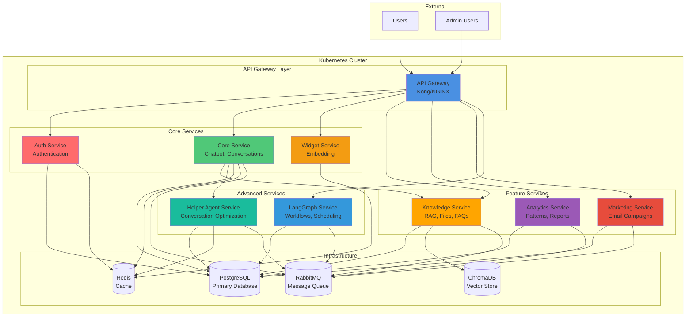
```mermaid
graph TB
    subgraph "External"
        User[Users]
        Admin[Admin Users]
    end
    
    subgraph "Kubernetes Cluster"
        subgraph "API Gateway Layer"
            Gateway[API Gateway<br/>Kong/NGINX]
        end
        
        subgraph "Core Services"
            Core[Core Service<br/>Chatbot, Conversations]
            Auth[Auth Service<br/>Authentication]
            Widget[Widget Service<br/>Embedding]
        end
        
        subgraph "Feature Services"
            Knowledge[Knowledge Service<br/>RAG, Files, FAQs]
            Analytics[Analytics Service<br/>Patterns, Reports]
            Marketing[Marketing Service<br/>Email Campaigns]
        end
        
        subgraph "Advanced Services"
            LangGraph[LangGraph Service<br/>Workflows, Scheduling]
            Helper[Helper Agent Service<br/>Conversation Optimization]
        end
        
        subgraph "Infrastructure"
            PostgreSQL[(PostgreSQL<br/>Primary Database)]
            ChromaDB[(ChromaDB<br/>Vector Store)]
            Redis[(Redis<br/>Cache)]
            RabbitMQ[(RabbitMQ<br/>Message Queue)]
        end
    end
    
    User --> Gateway
    Admin --> Gateway
    Gateway --> Auth
    Gateway --> Core
    Gateway --> Widget
    Gateway --> Knowledge
    Gateway --> Analytics
    Gateway --> Marketing
    Gateway --> LangGraph
    
    Core --> Knowledge
    Core --> Helper
    Core --> PostgreSQL
    Core --> Redis
    Core --> RabbitMQ
    
    Auth --> PostgreSQL
    Auth --> Redis
    
    Knowledge --> PostgreSQL
    Knowledge --> ChromaDB
    Knowledge --> RabbitMQ
    
    Analytics --> PostgreSQL
    Analytics --> RabbitMQ
    
    Marketing --> PostgreSQL
    Marketing --> RabbitMQ
    
    LangGraph --> PostgreSQL
    LangGraph --> RabbitMQ
    
    Helper --> PostgreSQL
    Helper --> Redis
    Helper --> RabbitMQ
    
    Widget --> Redis
    
    style Gateway fill:#4a90e2
    style Core fill:#50c878
    style Auth fill:#ff6b6b
    style Knowledge fill:#ffa500
    style Analytics fill:#9b59b6
    style Marketing fill:#e74c3c
    style LangGraph fill:#3498db
    style Helper fill:#1abc9c
    style Widget fill:#f39c12
```

## 2. Service Dependencies Graph

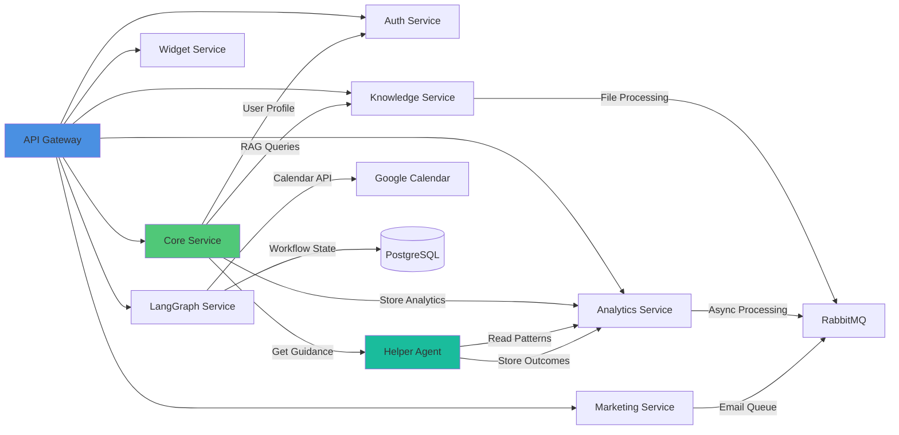
```mermaid
graph LR
    Gateway[API Gateway] --> Auth[Auth Service]
    Gateway --> Core[Core Service]
    Gateway --> Widget[Widget Service]
    Gateway --> Knowledge[Knowledge Service]
    Gateway --> Analytics[Analytics Service]
    Gateway --> Marketing[Marketing Service]
    Gateway --> LangGraph[LangGraph Service]
    
    Core -->|RAG Queries| Knowledge
    Core -->|Get Guidance| Helper[Helper Agent]
    Core -->|Store Analytics| Analytics
    Core -->|User Profile| Auth
    
    Helper -->|Read Patterns| Analytics
    Helper -->|Store Outcomes| Analytics
    
    Knowledge -->|File Processing| RabbitMQ[RabbitMQ]
    Analytics -->|Async Processing| RabbitMQ
    Marketing -->|Email Queue| RabbitMQ
    
    LangGraph -->|Calendar API| External[Google Calendar]
    LangGraph -->|Workflow State| PostgreSQL[(PostgreSQL)]
    
    style Gateway fill:#4a90e2
    style Core fill:#50c878
    style Helper fill:#1abc9c
```

## 3. Chat Flow Sequence Diagram

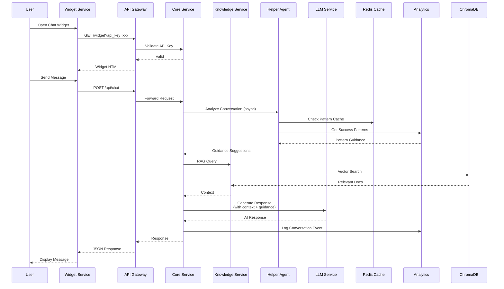
```mermaid
sequenceDiagram
    participant User
    participant Widget as Widget Service
    participant Gateway as API Gateway
    participant Core as Core Service
    participant Knowledge as Knowledge Service
    participant Helper as Helper Agent
    participant LLM as LLM Service
    participant Redis as Redis Cache
    
    User->>Widget: Open Chat Widget
    Widget->>Gateway: GET /widget?api_key=xxx
    Gateway->>Core: Validate API Key
    Core-->>Gateway: Valid
    Gateway-->>Widget: Widget HTML
    
    User->>Widget: Send Message
    Widget->>Gateway: POST /api/chat
    Gateway->>Core: Forward Request
    
    Core->>Helper: Analyze Conversation (async)
    Helper->>Redis: Check Pattern Cache
    Helper->>Analytics: Get Success Patterns
    Analytics-->>Helper: Pattern Guidance
    Helper-->>Core: Guidance Suggestions
    
    Core->>Knowledge: RAG Query
    Knowledge->>ChromaDB: Vector Search
    ChromaDB-->>Knowledge: Relevant Docs
    Knowledge-->>Core: Context
    
    Core->>LLM: Generate Response<br/>(with context + guidance)
    LLM-->>Core: AI Response
    
    Core->>Analytics: Log Conversation Event
    Core-->>Gateway: Response
    Gateway-->>Widget: JSON Response
    Widget-->>User: Display Message
```

## 4. User Signup Flow (Multi-Service)

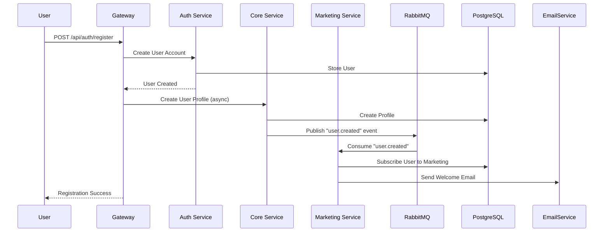
```mermaid
sequenceDiagram
    participant User
    participant Gateway
    participant Auth as Auth Service
    participant Core as Core Service
    participant Marketing as Marketing Service
    participant RabbitMQ
    
    User->>Gateway: POST /api/auth/register
    Gateway->>Auth: Create User Account
    Auth->>PostgreSQL: Store User
    Auth-->>Gateway: User Created
    
    Gateway->>Core: Create User Profile (async)
    Core->>PostgreSQL: Create Profile
    Core->>RabbitMQ: Publish "user.created" event
    
    RabbitMQ->>Marketing: Consume "user.created"
    Marketing->>PostgreSQL: Subscribe User to Marketing
    Marketing->>EmailService: Send Welcome Email
    
    Gateway-->>User: Registration Success
```

## 5. Database Architecture

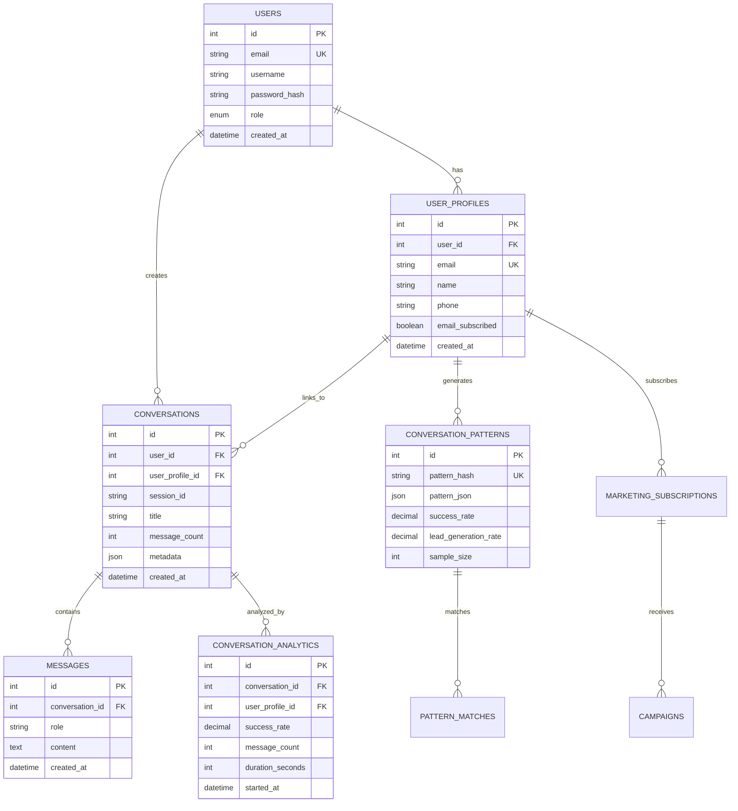
```mermaid
erDiagram
    USERS ||--o{ USER_PROFILES : has
    USERS ||--o{ CONVERSATIONS : creates
    CONVERSATIONS ||--o{ MESSAGES : contains
    USER_PROFILES ||--o{ CONVERSATIONS : links_to
    CONVERSATIONS ||--o{ CONVERSATION_ANALYTICS : analyzed_by
    USER_PROFILES ||--o{ CONVERSATION_PATTERNS : generates
    CONVERSATION_PATTERNS ||--o{ PATTERN_MATCHES : matches
    USER_PROFILES ||--o{ MARKETING_SUBSCRIPTIONS : subscribes
    MARKETING_SUBSCRIPTIONS ||--o{ CAMPAIGNS : receives
    
    USERS {
        int id PK
        string email UK
        string username
        string password_hash
        enum role
        datetime created_at
    }
    
    USER_PROFILES {
        int id PK
        int user_id FK
        string email UK
        string name
        string phone
        boolean email_subscribed
        datetime created_at
    }
    
    CONVERSATIONS {
        int id PK
        int user_id FK
        int user_profile_id FK
        string session_id
        string title
        int message_count
        json metadata
        datetime created_at
    }
    
    MESSAGES {
        int id PK
        int conversation_id FK
        string role
        text content
        datetime created_at
    }
    
    CONVERSATION_ANALYTICS {
        int id PK
        int conversation_id FK
        int user_profile_id FK
        decimal success_rate
        int message_count
        int duration_seconds
        datetime started_at
    }
    
    CONVERSATION_PATTERNS {
        int id PK
        string pattern_hash UK
        json pattern_json
        decimal success_rate
        decimal lead_generation_rate
        int sample_size
    }
```

## 6. Kubernetes Deployment Architecture

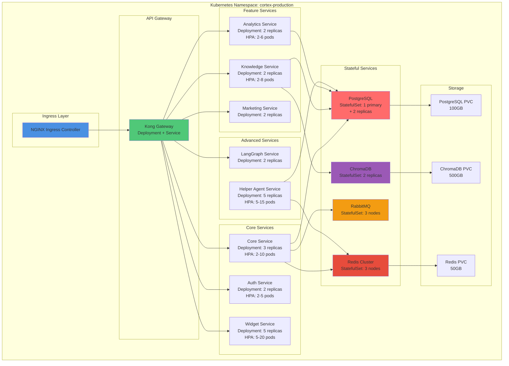
```mermaid
graph TB
    subgraph "Kubernetes Namespace: cortex-production"
        subgraph "Ingress Layer"
            Ingress[NGINX Ingress Controller]
        end
        
        subgraph "API Gateway"
            Kong[Kong Gateway<br/>Deployment + Service]
        end
        
        subgraph "Core Services"
            CoreDeploy[Core Service<br/>Deployment: 3 replicas<br/>HPA: 2-10 pods]
            AuthDeploy[Auth Service<br/>Deployment: 2 replicas<br/>HPA: 2-5 pods]
            WidgetDeploy[Widget Service<br/>Deployment: 5 replicas<br/>HPA: 5-20 pods]
        end
        
        subgraph "Feature Services"
            KnowledgeDeploy[Knowledge Service<br/>Deployment: 2 replicas<br/>HPA: 2-8 pods]
            AnalyticsDeploy[Analytics Service<br/>Deployment: 2 replicas<br/>HPA: 2-6 pods]
            MarketingDeploy[Marketing Service<br/>Deployment: 2 replicas]
        end
        
        subgraph "Advanced Services"
            LangGraphDeploy[LangGraph Service<br/>Deployment: 2 replicas]
            HelperDeploy[Helper Agent Service<br/>Deployment: 5 replicas<br/>HPA: 5-15 pods]
        end
        
        subgraph "Stateful Services"
            PostgreSQLStateful[PostgreSQL<br/>StatefulSet: 1 primary<br/>+ 2 replicas]
            RedisStateful[Redis Cluster<br/>StatefulSet: 3 nodes]
            RabbitMQStateful[RabbitMQ<br/>StatefulSet: 3 nodes]
            ChromaDBStateful[ChromaDB<br/>StatefulSet: 2 replicas]
        end
        
        subgraph "Storage"
            PV1[PostgreSQL PVC<br/>100GB]
            PV2[ChromaDB PVC<br/>500GB]
            PV3[Redis PVC<br/>50GB]
        end
    end
    
    Ingress --> Kong
    Kong --> CoreDeploy
    Kong --> AuthDeploy
    Kong --> WidgetDeploy
    Kong --> KnowledgeDeploy
    Kong --> AnalyticsDeploy
    Kong --> MarketingDeploy
    Kong --> LangGraphDeploy
    
    CoreDeploy --> PostgreSQLStateful
    CoreDeploy --> RedisStateful
    CoreDeploy --> RabbitMQStateful
    
    KnowledgeDeploy --> PostgreSQLStateful
    KnowledgeDeploy --> ChromaDBStateful
    
    AnalyticsDeploy --> PostgreSQLStateful
    HelperDeploy --> PostgreSQLStateful
    HelperDeploy --> RedisStateful
    
    PostgreSQLStateful --> PV1
    ChromaDBStateful --> PV2
    RedisStateful --> PV3
    
    style Ingress fill:#4a90e2
    style Kong fill:#50c878
    style PostgreSQLStateful fill:#ff6b6b
    style RedisStateful fill:#e74c3c
    style RabbitMQStateful fill:#f39c12
    style ChromaDBStateful fill:#9b59b6
```

## 7. Data Flow: Chat Request

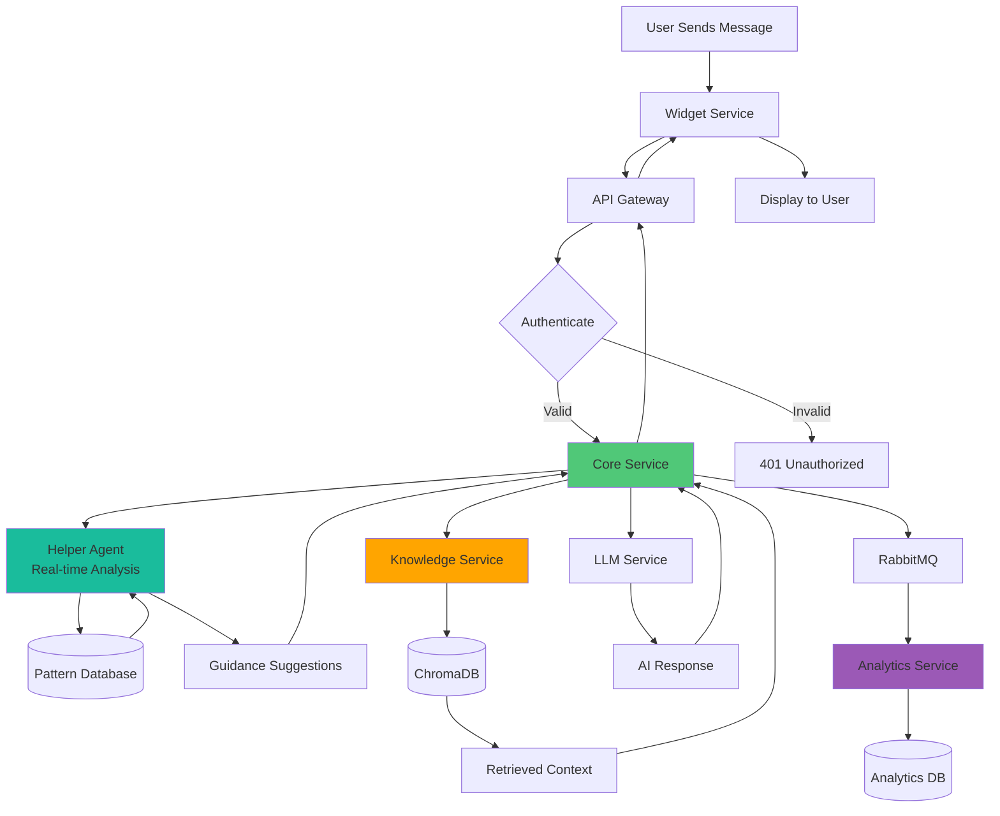
```mermaid
flowchart TD
    Start[User Sends Message] --> Widget[Widget Service]
    Widget --> Gateway[API Gateway]
    Gateway --> AuthCheck{Authenticate}
    AuthCheck -->|Valid| Core[Core Service]
    AuthCheck -->|Invalid| Error[401 Unauthorized]
    
    Core --> Helper[Helper Agent<br/>Real-time Analysis]
    Helper --> PatternDB[(Pattern Database)]
    PatternDB --> Helper
    Helper --> Guidance[Guidance Suggestions]
    Guidance --> Core
    
    Core --> Knowledge[Knowledge Service]
    Knowledge --> VectorDB[(ChromaDB)]
    VectorDB --> Context[Retrieved Context]
    Context --> Core
    
    Core --> LLM[LLM Service]
    LLM --> Response[AI Response]
    
    Core --> Queue[RabbitMQ]
    Queue --> Analytics[Analytics Service]
    Analytics --> AnalyticsDB[(Analytics DB)]
    
    Response --> Core
    Core --> Gateway
    Gateway --> Widget
    Widget --> User[Display to User]
    
    style Core fill:#50c878
    style Helper fill:#1abc9c
    style Knowledge fill:#ffa500
    style Analytics fill:#9b59b6
```

## 8. Service Communication Patterns

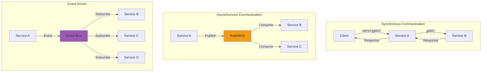
```mermaid
graph TB
    subgraph "Synchronous Communication"
        Client1[Client] -->|REST/gRPC| Service1[Service A]
        Service1 -->|gRPC| Service2[Service B]
        Service2 -->|Response| Service1
        Service1 -->|Response| Client1
    end
    
    subgraph "Asynchronous Communication"
        Service3[Service A] -->|Publish| Queue[RabbitMQ]
        Queue -->|Consume| Service4[Service B]
        Queue -->|Consume| Service5[Service C]
    end
    
    subgraph "Event-Driven"
        Service6[Service A] -->|Event| EventBus[Event Bus]
        EventBus -->|Subscribe| Service7[Service B]
        EventBus -->|Subscribe| Service8[Service C]
        EventBus -->|Subscribe| Service9[Service D]
    end
    
    style Queue fill:#f39c12
    style EventBus fill:#9b59b6
```

## 9. Scalability Architecture

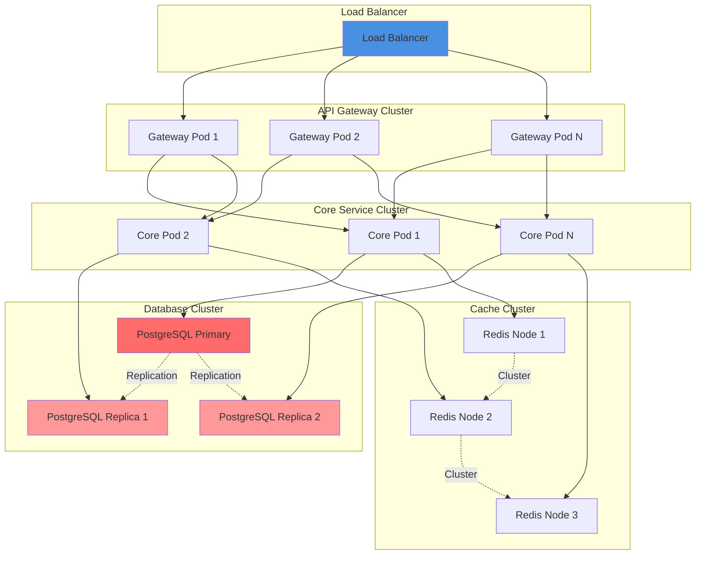
```mermaid
graph TB
    subgraph "Load Balancer"
        LB[Load Balancer]
    end
    
    subgraph "API Gateway Cluster"
        Gateway1[Gateway Pod 1]
        Gateway2[Gateway Pod 2]
        Gateway3[Gateway Pod N]
    end
    
    subgraph "Core Service Cluster"
        Core1[Core Pod 1]
        Core2[Core Pod 2]
        Core3[Core Pod N]
    end
    
    subgraph "Database Cluster"
        PG1[PostgreSQL Primary]
        PG2[PostgreSQL Replica 1]
        PG3[PostgreSQL Replica 2]
    end
    
    subgraph "Cache Cluster"
        Redis1[Redis Node 1]
        Redis2[Redis Node 2]
        Redis3[Redis Node 3]
    end
    
    LB --> Gateway1
    LB --> Gateway2
    LB --> Gateway3
    
    Gateway1 --> Core1
    Gateway1 --> Core2
    Gateway2 --> Core2
    Gateway2 --> Core3
    Gateway3 --> Core1
    Gateway3 --> Core3
    
    Core1 --> PG1
    Core2 --> PG2
    Core3 --> PG3
    
    Core1 --> Redis1
    Core2 --> Redis2
    Core3 --> Redis3
    
    PG1 -.->|Replication| PG2
    PG1 -.->|Replication| PG3
    
    Redis1 -.->|Cluster| Redis2
    Redis2 -.->|Cluster| Redis3
    
    style LB fill:#4a90e2
    style PG1 fill:#ff6b6b
    style PG2 fill:#ff9999
    style PG3 fill:#ff9999
```

## 10. Helper Agent System Flow

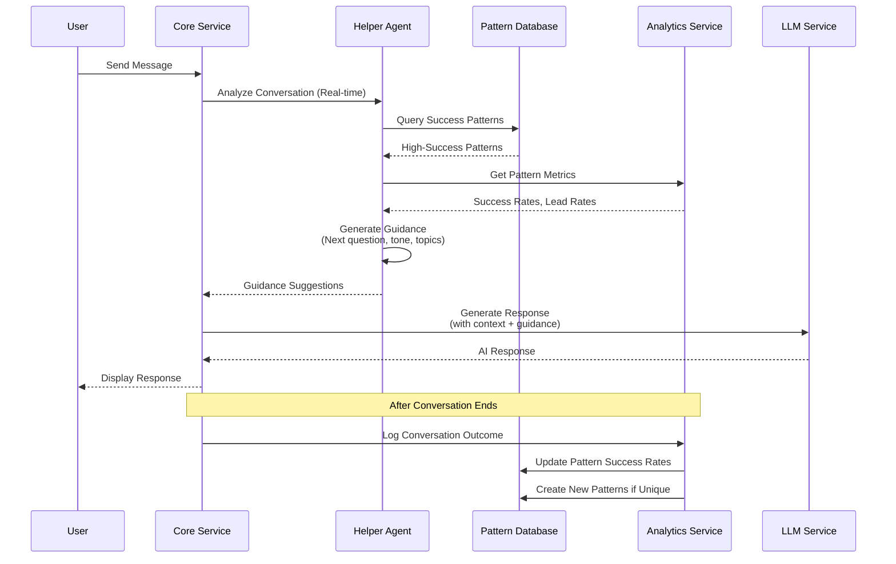
```mermaid
sequenceDiagram
    participant User
    participant Core as Core Service
    participant Helper as Helper Agent
    participant PatternDB as Pattern Database
    participant Analytics as Analytics Service
    participant LLM as LLM Service
    
    User->>Core: Send Message
    Core->>Helper: Analyze Conversation (Real-time)
    
    Helper->>PatternDB: Query Success Patterns
    PatternDB-->>Helper: High-Success Patterns
    
    Helper->>Analytics: Get Pattern Metrics
    Analytics-->>Helper: Success Rates, Lead Rates
    
    Helper->>Helper: Generate Guidance<br/>(Next question, tone, topics)
    Helper-->>Core: Guidance Suggestions
    
    Core->>LLM: Generate Response<br/>(with context + guidance)
    LLM-->>Core: AI Response
    
    Core-->>User: Display Response
    
    Note over Core,Analytics: After Conversation Ends
    Core->>Analytics: Log Conversation Outcome
    Analytics->>PatternDB: Update Pattern Success Rates
    Analytics->>PatternDB: Create New Patterns if Unique
```

## 11. Microservices Deployment Topology

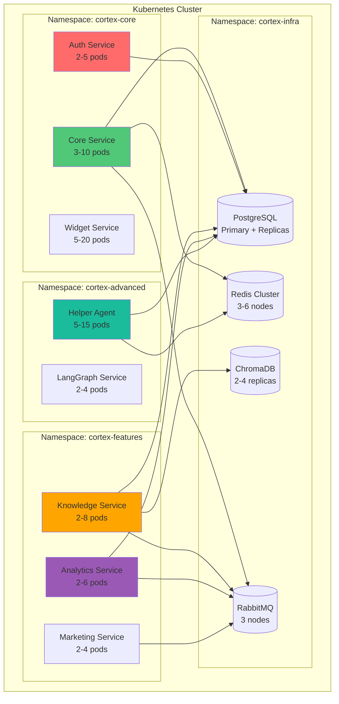
```mermaid
graph TB
    subgraph "Kubernetes Cluster"
        subgraph "Namespace: cortex-core"
            CoreSvc[Core Service<br/>3-10 pods]
            AuthSvc[Auth Service<br/>2-5 pods]
            WidgetSvc[Widget Service<br/>5-20 pods]
        end
        
        subgraph "Namespace: cortex-features"
            KnowledgeSvc[Knowledge Service<br/>2-8 pods]
            AnalyticsSvc[Analytics Service<br/>2-6 pods]
            MarketingSvc[Marketing Service<br/>2-4 pods]
        end
        
        subgraph "Namespace: cortex-advanced"
            LangGraphSvc[LangGraph Service<br/>2-4 pods]
            HelperSvc[Helper Agent<br/>5-15 pods]
        end
        
        subgraph "Namespace: cortex-infra"
            PostgreSQL[(PostgreSQL<br/>Primary + Replicas)]
            ChromaDB[(ChromaDB<br/>2-4 replicas)]
            Redis[(Redis Cluster<br/>3-6 nodes)]
            RabbitMQ[(RabbitMQ<br/>3 nodes)]
        end
    end
    
    CoreSvc --> PostgreSQL
    CoreSvc --> Redis
    AuthSvc --> PostgreSQL
    KnowledgeSvc --> PostgreSQL
    KnowledgeSvc --> ChromaDB
    AnalyticsSvc --> PostgreSQL
    HelperSvc --> PostgreSQL
    HelperSvc --> Redis
    
    CoreSvc --> RabbitMQ
    KnowledgeSvc --> RabbitMQ
    AnalyticsSvc --> RabbitMQ
    MarketingSvc --> RabbitMQ
    
    style CoreSvc fill:#50c878
    style AuthSvc fill:#ff6b6b
    style KnowledgeSvc fill:#ffa500
    style AnalyticsSvc fill:#9b59b6
    style HelperSvc fill:#1abc9c
```

## 12. CI/CD Pipeline Flow

```mermaid
graph LR
    Dev[Developer] -->|Push Code| Git[GitHub]
    Git -->|Trigger| CI[GitHub Actions<br/>CI Pipeline]
    
    CI --> Build[Build Docker Image]
    Build --> Test[Run Tests]
    Test --> Scan[Security Scan]
    Scan --> Push[Push to Registry]
    
    Push -->|Image Tag| Registry[Docker Registry]
    
    Registry -->|GitOps| ArgoCD[ArgoCD]
    ArgoCD -->|Deploy| K8s[Kubernetes]
    
    K8s -->|Health Check| Monitor[Prometheus]
    Monitor -->|Alerts| Team[DevOps Team]
    
    style CI fill:#4a90e2
    style ArgoCD fill:#50c878
    style K8s fill:#ff6b6b
```

## 13. Monitoring & Observability Stack

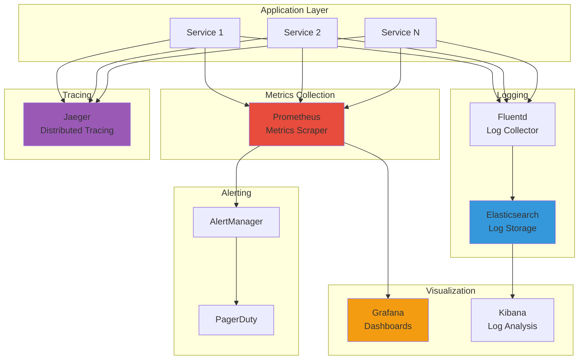
```mermaid
graph TB
    subgraph "Application Layer"
        App1[Service 1]
        App2[Service 2]
        App3[Service N]
    end
    
    subgraph "Metrics Collection"
        Prometheus[Prometheus<br/>Metrics Scraper]
    end
    
    subgraph "Logging"
        Fluentd[Fluentd<br/>Log Collector]
        Elasticsearch[Elasticsearch<br/>Log Storage]
    end
    
    subgraph "Tracing"
        Jaeger[Jaeger<br/>Distributed Tracing]
    end
    
    subgraph "Visualization"
        Grafana[Grafana<br/>Dashboards]
        Kibana[Kibana<br/>Log Analysis]
    end
    
    subgraph "Alerting"
        AlertManager[AlertManager]
        PagerDuty[PagerDuty]
    end
    
    App1 --> Prometheus
    App2 --> Prometheus
    App3 --> Prometheus
    
    App1 --> Fluentd
    App2 --> Fluentd
    App3 --> Fluentd
    
    App1 --> Jaeger
    App2 --> Jaeger
    App3 --> Jaeger
    
    Prometheus --> Grafana
    Prometheus --> AlertManager
    
    Fluentd --> Elasticsearch
    Elasticsearch --> Kibana
    
    AlertManager --> PagerDuty
    
    style Prometheus fill:#e74c3c
    style Grafana fill:#f39c12
    style Elasticsearch fill:#3498db
    style Jaeger fill:#9b59b6
```

## 14. Database Sharding Strategy (Future Scale)

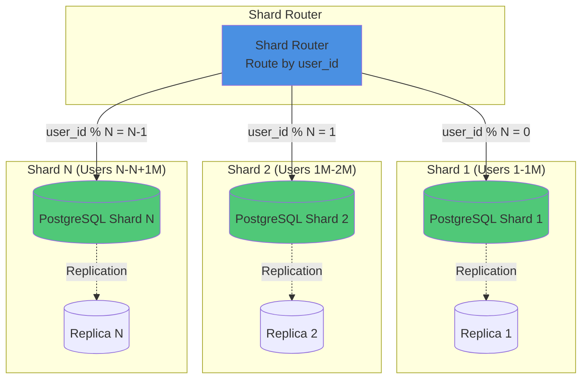
```mermaid
graph TB
    subgraph "Shard Router"
        Router[Shard Router<br/>Route by user_id]
    end
    
    subgraph "Shard 1 (Users 1-1M)"
        Shard1[(PostgreSQL Shard 1)]
        Replica1[(Replica 1)]
    end
    
    subgraph "Shard 2 (Users 1M-2M)"
        Shard2[(PostgreSQL Shard 2)]
        Replica2[(Replica 2)]
    end
    
    subgraph "Shard N (Users N-N+1M)"
        ShardN[(PostgreSQL Shard N)]
        ReplicaN[(Replica N)]
    end
    
    Router -->|user_id % N = 0| Shard1
    Router -->|user_id % N = 1| Shard2
    Router -->|user_id % N = N-1| ShardN
    
    Shard1 -.->|Replication| Replica1
    Shard2 -.->|Replication| Replica2
    ShardN -.->|Replication| ReplicaN
    
    style Router fill:#4a90e2
    style Shard1 fill:#50c878
    style Shard2 fill:#50c878
    style ShardN fill:#50c878
```

## 15. Event-Driven Architecture

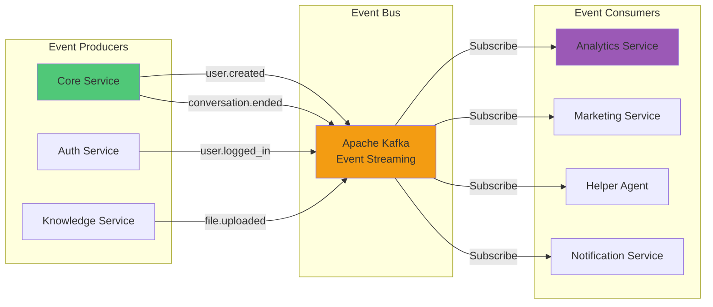
```mermaid
graph LR
    subgraph "Event Producers"
        Core[Core Service]
        Auth[Auth Service]
        Knowledge[Knowledge Service]
    end
    
    subgraph "Event Bus"
        Kafka[Apache Kafka<br/>Event Streaming]
    end
    
    subgraph "Event Consumers"
        Analytics[Analytics Service]
        Marketing[Marketing Service]
        Helper[Helper Agent]
        Notifications[Notification Service]
    end
    
    Core -->|user.created| Kafka
    Core -->|conversation.ended| Kafka
    Auth -->|user.logged_in| Kafka
    Knowledge -->|file.uploaded| Kafka
    
    Kafka -->|Subscribe| Analytics
    Kafka -->|Subscribe| Marketing
    Kafka -->|Subscribe| Helper
    Kafka -->|Subscribe| Notifications
    
    style Kafka fill:#f39c12
    style Core fill:#50c878
    style Analytics fill:#9b59b6
```

## 16. Database Architecture - Detailed Structure

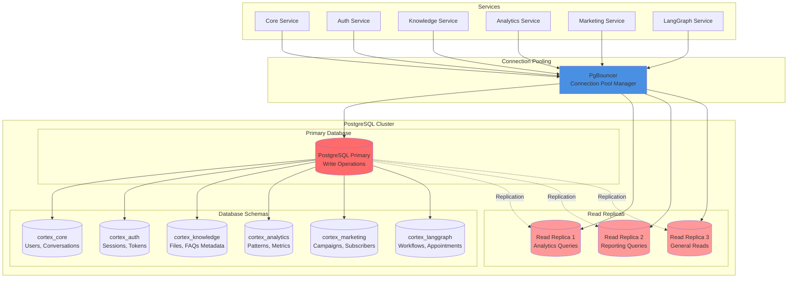
```mermaid
graph TB
    subgraph "PostgreSQL Cluster"
        subgraph "Primary Database"
            Primary[(PostgreSQL Primary<br/>Write Operations)]
        end
        
        subgraph "Read Replicas"
            Replica1[(Read Replica 1<br/>Analytics Queries)]
            Replica2[(Read Replica 2<br/>Reporting Queries)]
            Replica3[(Read Replica 3<br/>General Reads)]
        end
        
        subgraph "Database Schemas"
            Schema1[(cortex_core<br/>Users, Conversations)]
            Schema2[(cortex_auth<br/>Sessions, Tokens)]
            Schema3[(cortex_knowledge<br/>Files, FAQs Metadata)]
            Schema4[(cortex_analytics<br/>Patterns, Metrics)]
            Schema5[(cortex_marketing<br/>Campaigns, Subscribers)]
            Schema6[(cortex_langgraph<br/>Workflows, Appointments)]
        end
    end
    
    subgraph "Connection Pooling"
        PgBouncer[PgBouncer<br/>Connection Pool Manager]
    end
    
    subgraph "Services"
        CoreSvc[Core Service]
        AuthSvc[Auth Service]
        KnowledgeSvc[Knowledge Service]
        AnalyticsSvc[Analytics Service]
        MarketingSvc[Marketing Service]
        LangGraphSvc[LangGraph Service]
    end
    
    CoreSvc --> PgBouncer
    AuthSvc --> PgBouncer
    KnowledgeSvc --> PgBouncer
    AnalyticsSvc --> PgBouncer
    MarketingSvc --> PgBouncer
    LangGraphSvc --> PgBouncer
    
    PgBouncer --> Primary
    PgBouncer --> Replica1
    PgBouncer --> Replica2
    PgBouncer --> Replica3
    
    Primary --> Schema1
    Primary --> Schema2
    Primary --> Schema3
    Primary --> Schema4
    Primary --> Schema5
    Primary --> Schema6
    
    Primary -.->|Replication| Replica1
    Primary -.->|Replication| Replica2
    Primary -.->|Replication| Replica3
    
    style Primary fill:#ff6b6b
    style Replica1 fill:#ff9999
    style Replica2 fill:#ff9999
    style Replica3 fill:#ff9999
    style PgBouncer fill:#4a90e2
```

## 17. ChromaDB Architecture - Per-User Isolation

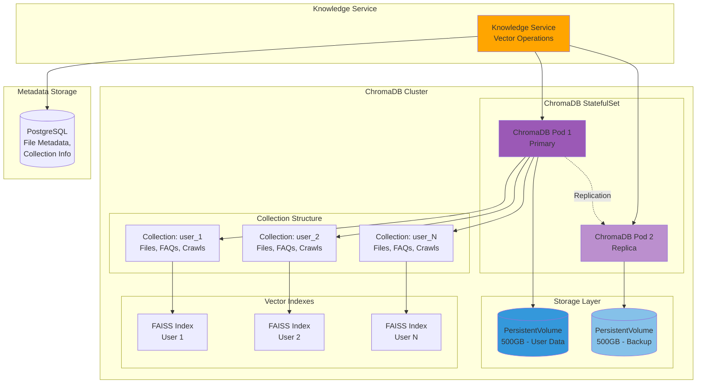
```mermaid
graph TB
    subgraph "ChromaDB Cluster"
        subgraph "ChromaDB StatefulSet"
            ChromaPod1[ChromaDB Pod 1<br/>Primary]
            ChromaPod2[ChromaDB Pod 2<br/>Replica]
        end
        
        subgraph "Storage Layer"
            PVC1[(PersistentVolume<br/>500GB - User Data)]
            PVC2[(PersistentVolume<br/>500GB - Backup)]
        end
        
        subgraph "Collection Structure"
            User1Col[Collection: user_1<br/>Files, FAQs, Crawls]
            User2Col[Collection: user_2<br/>Files, FAQs, Crawls]
            UserNCol[Collection: user_N<br/>Files, FAQs, Crawls]
        end
        
        subgraph "Vector Indexes"
            Index1[FAISS Index<br/>User 1]
            Index2[FAISS Index<br/>User 2]
            IndexN[FAISS Index<br/>User N]
        end
    end
    
    subgraph "Knowledge Service"
        KnowledgeSvc[Knowledge Service<br/>Vector Operations]
    end
    
    subgraph "Metadata Storage"
        MetadataDB[(PostgreSQL<br/>File Metadata,<br/>Collection Info)]
    end
    
    KnowledgeSvc --> ChromaPod1
    KnowledgeSvc --> ChromaPod2
    
    ChromaPod1 --> PVC1
    ChromaPod2 --> PVC2
    
    ChromaPod1 --> User1Col
    ChromaPod1 --> User2Col
    ChromaPod1 --> UserNCol
    
    User1Col --> Index1
    User2Col --> Index2
    UserNCol --> IndexN
    
    KnowledgeSvc --> MetadataDB
    
    ChromaPod1 -.->|Replication| ChromaPod2
    
    style ChromaPod1 fill:#9b59b6
    style ChromaPod2 fill:#bb8fce
    style PVC1 fill:#3498db
    style PVC2 fill:#85c1e9
    style KnowledgeSvc fill:#ffa500
```

## 18. ChromaDB Data Flow - Vector Operations

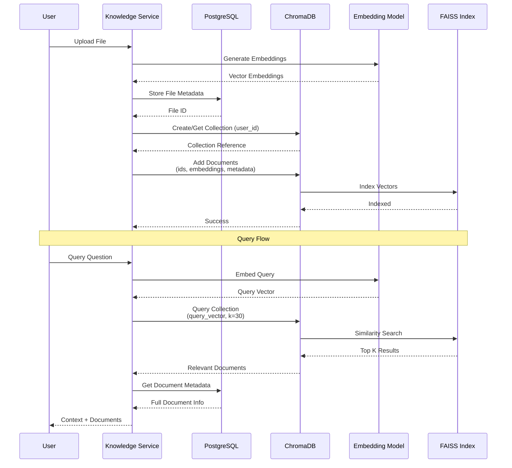
```mermaid
sequenceDiagram
    participant User
    participant Knowledge as Knowledge Service
    participant Metadata as PostgreSQL
    participant ChromaDB as ChromaDB
    participant Embedding as Embedding Model
    participant VectorIndex as FAISS Index
    
    User->>Knowledge: Upload File
    Knowledge->>Embedding: Generate Embeddings
    Embedding-->>Knowledge: Vector Embeddings
    
    Knowledge->>Metadata: Store File Metadata
    Metadata-->>Knowledge: File ID
    
    Knowledge->>ChromaDB: Create/Get Collection (user_id)
    ChromaDB-->>Knowledge: Collection Reference
    
    Knowledge->>ChromaDB: Add Documents<br/>(ids, embeddings, metadata)
    ChromaDB->>VectorIndex: Index Vectors
    VectorIndex-->>ChromaDB: Indexed
    ChromaDB-->>Knowledge: Success
    
    Note over User,VectorIndex: Query Flow
    User->>Knowledge: Query Question
    Knowledge->>Embedding: Embed Query
    Embedding-->>Knowledge: Query Vector
    
    Knowledge->>ChromaDB: Query Collection<br/>(query_vector, k=30)
    ChromaDB->>VectorIndex: Similarity Search
    VectorIndex-->>ChromaDB: Top K Results
    ChromaDB-->>Knowledge: Relevant Documents
    
    Knowledge->>Metadata: Get Document Metadata
    Metadata-->>Knowledge: Full Document Info
    Knowledge-->>User: Context + Documents
```

## 19. Config Files Architecture - Distribution & Management

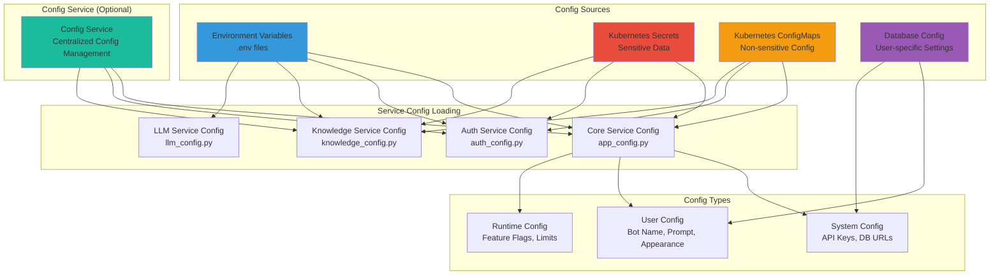
```mermaid
graph TB
    subgraph "Config Sources"
        EnvVars[Environment Variables<br/>.env files]
        K8sSecrets[Kubernetes Secrets<br/>Sensitive Data]
        K8sConfigMaps[Kubernetes ConfigMaps<br/>Non-sensitive Config]
        Database[Database Config<br/>User-specific Settings]
    end
    
    subgraph "Config Service (Optional)"
        ConfigSvc[Config Service<br/>Centralized Config Management]
    end
    
    subgraph "Service Config Loading"
        CoreConfig[Core Service Config<br/>app_config.py]
        AuthConfig[Auth Service Config<br/>auth_config.py]
        KnowledgeConfig[Knowledge Service Config<br/>knowledge_config.py]
        LLMConfig[LLM Service Config<br/>llm_config.py]
    end
    
    subgraph "Config Types"
        SystemConfig[System Config<br/>API Keys, DB URLs]
        UserConfig[User Config<br/>Bot Name, Prompt, Appearance]
        RuntimeConfig[Runtime Config<br/>Feature Flags, Limits]
    end
    
    EnvVars --> CoreConfig
    EnvVars --> AuthConfig
    EnvVars --> KnowledgeConfig
    EnvVars --> LLMConfig
    
    K8sSecrets --> CoreConfig
    K8sSecrets --> AuthConfig
    K8sSecrets --> KnowledgeConfig
    
    K8sConfigMaps --> CoreConfig
    K8sConfigMaps --> AuthConfig
    K8sConfigMaps --> KnowledgeConfig
    
    Database --> UserConfig
    Database --> SystemConfig
    
    ConfigSvc --> CoreConfig
    ConfigSvc --> AuthConfig
    ConfigSvc --> KnowledgeConfig
    
    CoreConfig --> SystemConfig
    CoreConfig --> UserConfig
    CoreConfig --> RuntimeConfig
    
    style EnvVars fill:#3498db
    style K8sSecrets fill:#e74c3c
    style K8sConfigMaps fill:#f39c12
    style Database fill:#9b59b6
    style ConfigSvc fill:#1abc9c
```

## 20. Config File Hierarchy & Priority

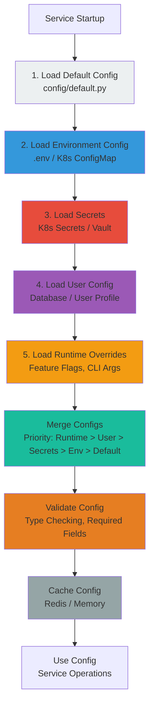
```mermaid
graph TD
    Start[Service Startup] --> Load1[1. Load Default Config<br/>config/default.py]
    Load1 --> Load2[2. Load Environment Config<br/>.env / K8s ConfigMap]
    Load2 --> Load3[3. Load Secrets<br/>K8s Secrets / Vault]
    Load3 --> Load4[4. Load User Config<br/>Database / User Profile]
    Load4 --> Load5[5. Load Runtime Overrides<br/>Feature Flags, CLI Args]
    Load5 --> Merge[Merge Configs<br/>Priority: Runtime > User > Secrets > Env > Default]
    Merge --> Validate[Validate Config<br/>Type Checking, Required Fields]
    Validate --> Cache[Cache Config<br/>Redis / Memory]
    Cache --> Use[Use Config<br/>Service Operations]
    
    style Load1 fill:#ecf0f1
    style Load2 fill:#3498db
    style Load3 fill:#e74c3c
    style Load4 fill:#9b59b6
    style Load5 fill:#f39c12
    style Merge fill:#1abc9c
    style Validate fill:#e67e22
    style Cache fill:#95a5a6
```

## 21. Config Files Structure - Per Service

```mermaid
graph LR
    subgraph "Core Service Config"
        CoreRoot[config/]
        CoreRoot --> CoreDefault[default.py<br/>Default values]
        CoreRoot --> CoreDev[development.py<br/>Dev overrides]
        CoreRoot --> CoreProd[production.py<br/>Prod overrides]
        CoreRoot --> CoreTest[testing.py<br/>Test config]
    end
    
    subgraph "Auth Service Config"
        AuthRoot[config/]
        AuthRoot --> AuthDefault[default.py]
        AuthRoot --> AuthJWT[jwt_config.py<br/>JWT settings]
        AuthRoot --> AuthOAuth[oauth_config.py<br/>OAuth providers]
    end
    
    subgraph "Knowledge Service Config"
        KnowledgeRoot[config/]
        KnowledgeRoot --> KnowledgeDefault[default.py]
        KnowledgeRoot --> KnowledgeChroma[chromadb_config.py<br/>Vector DB settings]
        KnowledgeRoot --> KnowledgeEmbed[embedding_config.py<br/>Embedding model]
    end
    
    subgraph "LLM Service Config"
        LLMRoot[config/]
        LLMRoot --> LLMDefault[default.py]
        LLMRoot --> LLMProviders[providers_config.py<br/>OpenAI, Anthropic, etc.]
        LLMRoot --> LLMKeys[api_keys_config.py<br/>Key management]
    end
    
    subgraph "Shared Config"
        SharedRoot[shared_config/]
        SharedRoot --> SharedDB[database.py<br/>DB connections]
        SharedRoot --> SharedRedis[redis.py<br/>Cache config]
        SharedRoot --> SharedQueue[queue.py<br/>RabbitMQ config]
        SharedRoot --> SharedLogging[logging.py<br/>Log config]
    end
    
    style CoreRoot fill:#50c878
    style AuthRoot fill:#ff6b6b
    style KnowledgeRoot fill:#ffa500
    style LLMRoot fill:#3498db
    style SharedRoot fill:#9b59b6
```

## 22. Database Schema Distribution

```mermaid
erDiagram
    subgraph "Core Service Database"
        USERS ||--o{ USER_PROFILES : has
        USERS ||--o{ CONVERSATIONS : creates
        CONVERSATIONS ||--o{ MESSAGES : contains
        USER_PROFILES ||--o{ CHATBOT_APPEARANCE : configures
        USER_PROFILES ||--o{ ADMIN_API_KEYS : owns
    end
    
    subgraph "Auth Service Database"
        SESSIONS ||--o{ USERS : belongs_to
        TOKENS ||--o{ USERS : belongs_to
        OAUTH_PROVIDERS ||--o{ USERS : authenticates
    end
    
    subgraph "Knowledge Service Database"
        FILES ||--o{ FILE_CHUNKS : contains
        FAQS ||--o{ FAQ_CATEGORIES : categorized_by
        CRAWLS ||--o{ CRAWL_PAGES : contains
        FILES ||--o{ CHROMADB_COLLECTIONS : indexed_in
    end
    
    subgraph "Analytics Service Database"
        CONVERSATION_ANALYTICS ||--o{ CONVERSATION_PATTERNS : matches
        CONVERSATION_PATTERNS ||--o{ PATTERN_MATCHES : generates
        USER_BEHAVIOR ||--o{ CONVERSATION_ANALYTICS : tracks
    end
    
    subgraph "Marketing Service Database"
        MARKETING_SUBSCRIPTIONS ||--o{ CAMPAIGNS : receives
        CAMPAIGNS ||--o{ EMAIL_TEMPLATES : uses
        CAMPAIGNS ||--o{ CAMPAIGN_ANALYTICS : tracks
    end
    
    USERS {
        int id PK
        string email UK
        string username
        string password_hash
        enum role
    }
    
    USER_PROFILES {
        int id PK
        int user_id FK
        string email UK
        string name
        boolean email_subscribed
    }
    
    CONVERSATIONS {
        int id PK
        int user_id FK
        int user_profile_id FK
        string session_id
        json metadata
    }
    
    FILES {
        int id PK
        int user_id FK
        string filename
        string chromadb_collection_id
        json metadata
    }
    
    CONVERSATION_PATTERNS {
        int id PK
        string pattern_hash UK
        json pattern_json
        decimal success_rate
    }
```

## 23. ChromaDB Collection Isolation Strategy

```mermaid
graph TB
    subgraph "ChromaDB Instance"
        subgraph "Collection Naming"
            User1[Collection: user_1<br/>Namespace: default]
            User2[Collection: user_2<br/>Namespace: default]
            UserN[Collection: user_N<br/>Namespace: default]
        end
        
        subgraph "Collection Structure"
            Col1[Collection: user_1]
            Col1 --> Docs1[Documents<br/>Chunked Files]
            Col1 --> Embeddings1[Embeddings<br/>1536-dim vectors]
            Col1 --> Metadata1[Metadata<br/>source, type, timestamp]
            
            Col2[Collection: user_2]
            Col2 --> Docs2[Documents]
            Col2 --> Embeddings2[Embeddings]
            Col2 --> Metadata2[Metadata]
        end
        
        subgraph "Index Management"
            Index1[FAISS Index<br/>User 1<br/>Optimized for Search]
            Index2[FAISS Index<br/>User 2<br/>Optimized for Search]
        end
    end
    
    subgraph "Knowledge Service"
        Service[Knowledge Service]
        Service -->|Get Collection| User1
        Service -->|Get Collection| User2
        Service -->|Get Collection| UserN
    end
    
    subgraph "Access Control"
        Auth[Authentication<br/>Verify user_id]
        Auth -->|Authorized| Service
    end
    
    User1 --> Index1
    User2 --> Index2
    
    style User1 fill:#9b59b6
    style User2 fill:#9b59b6
    style Index1 fill:#3498db
    style Index2 fill:#3498db
    style Auth fill:#e74c3c
```

## 24. Config File Sync & Updates

```mermaid
sequenceDiagram
    participant Admin
    participant Dashboard as Admin Dashboard
    participant ConfigSvc as Config Service
    participant K8s as Kubernetes
    participant Services as All Services
    participant Redis as Redis Cache
    
    Admin->>Dashboard: Update Config
    Dashboard->>ConfigSvc: POST /api/config/update
    ConfigSvc->>K8s: Update ConfigMap/Secret
    K8s-->>ConfigSvc: Updated
    
    ConfigSvc->>Redis: Invalidate Config Cache
    Redis-->>ConfigSvc: Cache Cleared
    
    ConfigSvc->>K8s: Trigger Config Reload<br/>(Rolling Restart or Signal)
    K8s->>Services: Reload Config
    Services->>K8s: Read New Config
    Services->>Redis: Refresh Cache
    
    Services-->>Admin: Config Updated
```

## 25. Database Backup & Recovery Strategy

```mermaid
graph TB
    subgraph "Backup Strategy"
        subgraph "PostgreSQL Backups"
            PGDaily[Daily Full Backup<br/>pg_dump]
            PGWeekly[Weekly Full Backup<br/>Archive]
            PGContinuous[Continuous WAL<br/>Write-Ahead Logs]
        end
        
        subgraph "ChromaDB Backups"
            ChromaDaily[Daily Collection Export<br/>JSON/Parquet]
            ChromaSnapshot[Snapshot to S3<br/>Full State]
        end
        
        subgraph "Config Backups"
            ConfigGit[Git Repository<br/>Version Control]
            ConfigS3[S3 Bucket<br/>Encrypted Backups]
        end
    end
    
    subgraph "Storage"
        S3[(S3 Bucket<br/>Backup Storage)]
        Local[(Local Storage<br/>Recent Backups)]
    end
    
    subgraph "Recovery Process"
        Restore[Restore Process]
        Restore --> Validate[Validate Backup]
        Validate --> Apply[Apply to Database]
        Apply --> Verify[Verify Data Integrity]
    end
    
    PGDaily --> S3
    PGWeekly --> S3
    PGContinuous --> S3
    ChromaDaily --> S3
    ChromaSnapshot --> S3
    ConfigGit --> S3
    ConfigS3 --> S3
    
    PGDaily --> Local
    ChromaDaily --> Local
    
    S3 --> Restore
    
    style PGDaily fill:#3498db
    style ChromaDaily fill:#9b59b6
    style ConfigGit fill:#1abc9c
    style S3 fill:#f39c12
    style Restore fill:#e74c3c
```

## Usage Instructions

These Mermaid diagrams can be:
1. **Rendered in GitHub**: GitHub automatically renders Mermaid diagrams in markdown files
2. **Rendered in VS Code**: Install "Markdown Preview Mermaid Support" extension
3. **Rendered online**: Use https://mermaid.live/ to view and edit
4. **Exported**: Use Mermaid CLI to export as PNG/SVG

## Diagram Files

- **High-Level Architecture**: Overview of all microservices
- **Service Dependencies**: How services interact
- **Chat Flow**: Sequence of chat request processing
- **User Signup Flow**: Multi-service registration process
- **Database Architecture**: ER diagram of data relationships
- **Kubernetes Deployment**: K8s deployment structure
- **Data Flow**: Chat request processing flow
- **Service Communication**: Sync, async, and event-driven patterns
- **Scalability Architecture**: Load balancing and clustering
- **Helper Agent System**: Real-time conversation optimization flow
- **Microservices Topology**: Namespace organization
- **CI/CD Pipeline**: Deployment automation flow
- **Monitoring Stack**: Observability architecture
- **Database Sharding**: Future scaling strategy
- **Event-Driven Architecture**: Event streaming pattern
- **Database Architecture (Detailed)**: PostgreSQL cluster structure
- **ChromaDB Architecture**: Per-user isolation and structure
- **ChromaDB Data Flow**: Vector operations sequence
- **Config Files Architecture**: Distribution and management
- **Config File Hierarchy**: Priority and loading order
- **Config Files Structure**: Per-service organization
- **Database Schema Distribution**: Schema per service
- **ChromaDB Collection Isolation**: User isolation strategy
- **Config File Sync**: Update and sync process
- **Database Backup & Recovery**: Backup strategy and recovery

