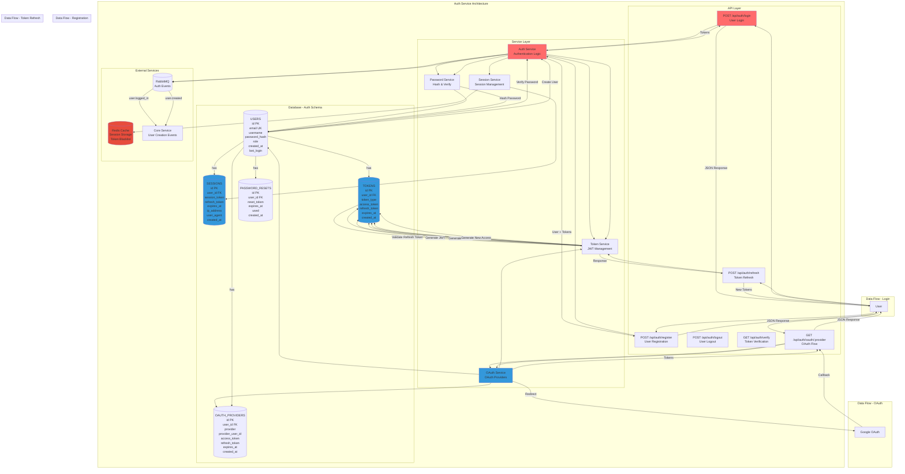

# Auth Service - Detailed Architecture Diagram

## Overview
The Auth Service handles authentication, authorization, session management, and OAuth integration.

## Database Schema Details

### USERS Table
- **Primary Key**: `id` (int)
- **Unique Key**: `email` (string)
- **Fields**: username, password_hash, role, created_at, last_login
- **Indexes**: email (unique), username

### SESSIONS Table
- **Primary Key**: `id` (int)
- **Foreign Key**: `user_id` → USERS.id
- **Fields**: session_token, refresh_token, expires_at, ip_address, user_agent, created_at
- **Indexes**: session_token (unique), user_id, expires_at
- **TTL**: Auto-delete expired sessions

### TOKENS Table
- **Primary Key**: `id` (int)
- **Foreign Key**: `user_id` → USERS.id
- **Fields**: token_type, access_token, refresh_token, expires_at, created_at
- **Indexes**: access_token (unique), refresh_token (unique), user_id, expires_at
- **TTL**: Auto-delete expired tokens

### OAUTH_PROVIDERS Table
- **Primary Key**: `id` (int)
- **Foreign Key**: `user_id` → USERS.id
- **Fields**: provider, provider_user_id, access_token, refresh_token, expires_at, created_at
- **Indexes**: provider + provider_user_id (unique), user_id
- **Supported Providers**: Google, GitHub, Microsoft

### PASSWORD_RESETS Table
- **Primary Key**: `id` (int)
- **Foreign Key**: `user_id` → USERS.id
- **Fields**: reset_token, expires_at, used, created_at
- **Indexes**: reset_token (unique), user_id, expires_at
- **TTL**: Auto-delete expired/used tokens

## Service Responsibilities

### Auth Service
- Validate user credentials
- Manage authentication flow
- Coordinate with other services
- Handle authorization checks

### Token Service
- Generate JWT access tokens
- Generate refresh tokens
- Validate token signatures
- Manage token expiration
- Blacklist revoked tokens

### Session Service
- Create and manage user sessions
- Store session data in Redis
- Validate session tokens
- Handle session expiration

### OAuth Service
- Handle OAuth provider integration
- Manage OAuth tokens
- Link OAuth accounts to users
- Support multiple providers

### Password Service
- Hash passwords (bcrypt)
- Verify password hashes
- Generate password reset tokens
- Enforce password policies

## API Endpoints

### POST /api/auth/login
- **Input**: `email`, `password`
- **Output**: `access_token`, `refresh_token`, `user`
- **Flow**: Validate → Hash Check → Generate Tokens → Create Session → Return

### POST /api/auth/register
- **Input**: `email`, `username`, `password`
- **Output**: `access_token`, `refresh_token`, `user`
- **Flow**: Validate → Hash Password → Create User → Generate Tokens → Create Session → Emit Event → Return

### POST /api/auth/refresh
- **Input**: `refresh_token`
- **Output**: `access_token`, `refresh_token`
- **Flow**: Validate Refresh Token → Generate New Tokens → Return

### POST /api/auth/logout
- **Input**: `access_token` (header)
- **Output**: Success message
- **Flow**: Validate Token → Blacklist Token → Delete Session → Return

### GET /api/auth/verify
- **Input**: `access_token` (header)
- **Output**: `user`, `valid`
- **Flow**: Validate Token → Check Blacklist → Return User Info

### GET /api/auth/oauth/:provider
- **Input**: `provider` (path), `code` (query)
- **Output**: `access_token`, `refresh_token`, `user`
- **Flow**: Redirect to Provider → Handle Callback → Exchange Code → Create/Link User → Generate Tokens → Return

## Security Features

### JWT Tokens
- **Access Token**: Short-lived (15 minutes), contains user info
- **Refresh Token**: Long-lived (7 days), stored securely
- **Algorithm**: HS256 or RS256
- **Claims**: user_id, email, role, exp, iat

### Password Security
- **Hashing**: bcrypt with salt rounds (12)
- **Validation**: Minimum 8 characters, complexity requirements
- **Reset**: Secure token generation, time-limited

### Session Security
- **Storage**: Redis with TTL
- **Validation**: Token signature + expiration check
- **Revocation**: Blacklist in Redis

### OAuth Security
- **State Parameter**: CSRF protection
- **PKCE**: For public clients
- **Token Storage**: Encrypted in database

## Integration Points

### Redis Cache
- **Purpose**: Session storage, token blacklist
- **TTL**: Sessions (30 days), Blacklist (token expiration)
- **Data**: Session data, blacklisted token IDs

### Core Service
- **Purpose**: User creation events
- **Method**: RabbitMQ message
- **Event**: `user.created` → Create user profile

### RabbitMQ
- **Purpose**: Auth event publishing
- **Events**: `user.created`, `user.logged_in`, `user.logged_out`
- **Consumers**: Core Service, Analytics Service

