# Combined Data Architecture: Databases, ChromaDB, Config & Backup Strategy

This diagram combines Database Schema Distribution, ChromaDB Collection Isolation, Config File Sync, and Backup & Recovery Strategy into a single comprehensive view.

```mermaid
graph TB
    subgraph "PostgreSQL Database Cluster"
        subgraph "Core Service Schema"
            Users[(USERS<br/>id, email, username<br/>password_hash, role)]
            UserProfiles[(USER_PROFILES<br/>id, user_id FK<br/>email, name<br/>email_subscribed)]
            Conversations[(CONVERSATIONS<br/>id, user_id FK<br/>session_id, metadata)]
            Messages[(MESSAGES<br/>id, conversation_id FK<br/>role, content)]
            ChatbotAppearance[(CHATBOT_APPEARANCE<br/>user_id FK<br/>bot_name, welcome_message)]
            AdminAPIKeys[(ADMIN_API_KEYS<br/>id, user_id FK<br/>key_hash, type)]
            
            Users -->|has| UserProfiles
            Users -->|creates| Conversations
            Conversations -->|contains| Messages
            UserProfiles -->|configures| ChatbotAppearance
            UserProfiles -->|owns| AdminAPIKeys
        end
        
        subgraph "Auth Service Schema"
            Sessions[(SESSIONS<br/>id, user_id FK<br/>token, expires)]
            Tokens[(TOKENS<br/>id, user_id FK<br/>refresh_token)]
            OAuthProviders[(OAUTH_PROVIDERS<br/>id, user_id FK<br/>provider, provider_id)]
            
            Users -.->|belongs_to| Sessions
            Users -.->|belongs_to| Tokens
            Users -.->|authenticates| OAuthProviders
        end
        
        subgraph "Knowledge Service Schema"
            Files[(FILES<br/>id, user_id FK<br/>filename, chromadb_collection_id)]
            FileChunks[(FILE_CHUNKS<br/>id, file_id FK<br/>chunk_text, chunk_index)]
            FAQs[(FAQS<br/>id, user_id FK<br/>question, answer)]
            FAQCategories[(FAQ_CATEGORIES<br/>id, faq_id FK<br/>category)]
            Crawls[(CRAWLS<br/>id, user_id FK<br/>url, status)]
            CrawlPages[(CRAWL_PAGES<br/>id, crawl_id FK<br/>url, content)]
            
            Files -->|contains| FileChunks
            FAQs -->|categorized_by| FAQCategories
            Crawls -->|contains| CrawlPages
            Files -.->|indexed_in| ChromaCollections
        end
        
        subgraph "Analytics Service Schema"
            ConversationAnalytics[(CONVERSATION_ANALYTICS<br/>id, conversation_id FK<br/>success_rate, duration)]
            ConversationPatterns[(CONVERSATION_PATTERNS<br/>id, pattern_hash UK<br/>pattern_json, success_rate)]
            PatternMatches[(PATTERN_MATCHES<br/>id, pattern_id FK<br/>conversation_id FK)]
            UserBehavior[(USER_BEHAVIOR<br/>id, user_profile_id FK<br/>actions, timestamps)]
            
            ConversationAnalytics -->|matches| ConversationPatterns
            ConversationPatterns -->|generates| PatternMatches
            UserBehavior -->|tracks| ConversationAnalytics
        end
        
        subgraph "Marketing Service Schema"
            MarketingSubscriptions[(MARKETING_SUBSCRIPTIONS<br/>id, user_profile_id FK<br/>email, subscribed)]
            Campaigns[(CAMPAIGNS<br/>id, name, status<br/>sent_count)]
            EmailTemplates[(EMAIL_TEMPLATES<br/>id, campaign_id FK<br/>subject, body)]
            CampaignAnalytics[(CAMPAIGN_ANALYTICS<br/>id, campaign_id FK<br/>opens, clicks)]
            
            MarketingSubscriptions -->|receives| Campaigns
            Campaigns -->|uses| EmailTemplates
            Campaigns -->|tracks| CampaignAnalytics
        end
    end
    
    subgraph "ChromaDB Vector Database"
        subgraph "Collection Isolation"
            ChromaCollections[ChromaDB Collections<br/>Per-User Isolation]
            User1Col[Collection: user_1<br/>Namespace: default]
            User2Col[Collection: user_2<br/>Namespace: default]
            UserNCol[Collection: user_N<br/>Namespace: default]
            
            ChromaCollections --> User1Col
            ChromaCollections --> User2Col
            ChromaCollections --> UserNCol
        end
        
        subgraph "Collection Structure"
            Col1[Collection: user_1]
            Col1 --> Docs1[Documents<br/>Chunked Files]
            Col1 --> Embeddings1[Embeddings<br/>1536-dim vectors]
            Col1 --> Metadata1[Metadata<br/>source, type, timestamp]
            
            Col2[Collection: user_2]
            Col2 --> Docs2[Documents]
            Col2 --> Embeddings2[Embeddings]
            Col2 --> Metadata2[Metadata]
        end
        
        subgraph "Vector Indexes"
            Index1[FAISS Index<br/>User 1<br/>Optimized Search]
            Index2[FAISS Index<br/>User 2<br/>Optimized Search]
            
            User1Col --> Index1
            User2Col --> Index2
        end
        
        KnowledgeService[Knowledge Service<br/>Vector Operations]
        KnowledgeService -->|Get Collection| User1Col
        KnowledgeService -->|Get Collection| User2Col
        KnowledgeService -->|Get Collection| UserNCol
        
        AuthControl[Authentication<br/>Verify user_id]
        AuthControl -->|Authorized| KnowledgeService
    end
    
    subgraph "Config Management System"
        subgraph "Config Sources"
            EnvVars[Environment Variables<br/>.env files]
            K8sSecrets[Kubernetes Secrets<br/>Sensitive Data]
            K8sConfigMaps[Kubernetes ConfigMaps<br/>Non-sensitive Config]
            DBConfig[Database Config<br/>User-specific Settings]
        end
        
        subgraph "Config Service"
            ConfigService[Config Service<br/>Centralized Management]
            ConfigService --> EnvVars
            ConfigService --> K8sSecrets
            ConfigService --> K8sConfigMaps
            ConfigService --> DBConfig
        end
        
        subgraph "Config Sync Flow"
            Admin[Admin User]
            Dashboard[Admin Dashboard]
            K8s[Kubernetes Cluster]
            RedisCache[Redis Cache<br/>Config Cache]
            AllServices[All Services<br/>Config Consumers]
            
            Admin -->|Update Config| Dashboard
            Dashboard -->|POST /api/config/update| ConfigService
            ConfigService -->|Update| K8s
            ConfigService -->|Invalidate| RedisCache
            ConfigService -->|Trigger Reload| K8s
            K8s -->|Read Config| AllServices
            AllServices -->|Refresh| RedisCache
        end
    end
    
    subgraph "Backup & Recovery System"
        subgraph "PostgreSQL Backups"
            PGDaily[Daily Full Backup<br/>pg_dump]
            PGWeekly[Weekly Full Backup<br/>Archive]
            PGContinuous[Continuous WAL<br/>Write-Ahead Logs]
        end
        
        subgraph "ChromaDB Backups"
            ChromaDaily[Daily Collection Export<br/>JSON/Parquet]
            ChromaSnapshot[Snapshot to S3<br/>Full State]
        end
        
        subgraph "Config Backups"
            ConfigGit[Git Repository<br/>Version Control]
            ConfigS3[S3 Bucket<br/>Encrypted Backups]
        end
        
        subgraph "Backup Storage"
            S3Storage[(S3 Bucket<br/>Backup Storage)]
            LocalStorage[(Local Storage<br/>Recent Backups)]
        end
        
        subgraph "Recovery Process"
            RestoreProcess[Restore Process]
            ValidateBackup[Validate Backup]
            ApplyBackup[Apply to Database]
            VerifyIntegrity[Verify Data Integrity]
            
            RestoreProcess --> ValidateBackup
            ValidateBackup --> ApplyBackup
            ApplyBackup --> VerifyIntegrity
        end
        
        PGDaily --> S3Storage
        PGWeekly --> S3Storage
        PGContinuous --> S3Storage
        ChromaDaily --> S3Storage
        ChromaSnapshot --> S3Storage
        ConfigGit --> S3Storage
        ConfigS3 --> S3Storage
        
        PGDaily --> LocalStorage
        ChromaDaily --> LocalStorage
        
        S3Storage --> RestoreProcess
    end
    
    subgraph "Service Connections"
        CoreSvc[Core Service] --> Users
        CoreSvc --> UserProfiles
        CoreSvc --> Conversations
        CoreSvc --> Messages
        
        AuthSvc[Auth Service] --> Sessions
        AuthSvc --> Tokens
        AuthSvc --> OAuthProviders
        
        KnowledgeSvc[Knowledge Service] --> Files
        KnowledgeSvc --> FAQs
        KnowledgeSvc --> Crawls
        KnowledgeSvc --> ChromaCollections
        
        AnalyticsSvc[Analytics Service] --> ConversationAnalytics
        AnalyticsSvc --> ConversationPatterns
        
        MarketingSvc[Marketing Service] --> MarketingSubscriptions
        MarketingSvc --> Campaigns
    end
    
    style Users fill:#3498db
    style UserProfiles fill:#3498db
    style Conversations fill:#3498db
    style ChromaCollections fill:#9b59b6
    style User1Col fill:#9b59b6
    style User2Col fill:#9b59b6
    style Index1 fill:#3498db
    style Index2 fill:#3498db
    style ConfigService fill:#1abc9c
    style RedisCache fill:#e74c3c
    style PGDaily fill:#3498db
    style ChromaDaily fill:#9b59b6
    style ConfigGit fill:#1abc9c
    style S3Storage fill:#f39c12
    style RestoreProcess fill:#e74c3c
    style KnowledgeService fill:#ffa500
    style AuthControl fill:#e74c3c
```

## Diagram Components

### 1. PostgreSQL Database Cluster
- **Core Service Schema**: Users, profiles, conversations, messages, chatbot appearance, API keys
- **Auth Service Schema**: Sessions, tokens, OAuth providers
- **Knowledge Service Schema**: Files, FAQs, crawls with metadata
- **Analytics Service Schema**: Conversation analytics, patterns, user behavior
- **Marketing Service Schema**: Subscriptions, campaigns, email templates

### 2. ChromaDB Vector Database
- **Collection Isolation**: Per-user collections (user_1, user_2, user_N)
- **Collection Structure**: Documents, embeddings (1536-dim), metadata
- **Vector Indexes**: FAISS indexes optimized for search per user
- **Access Control**: Authentication layer for user verification

### 3. Config Management System
- **Config Sources**: Environment variables, K8s secrets, ConfigMaps, database
- **Config Service**: Centralized configuration management
- **Config Sync Flow**: Admin → Dashboard → Config Service → K8s → Services → Redis cache

### 4. Backup & Recovery System
- **PostgreSQL Backups**: Daily full, weekly archive, continuous WAL
- **ChromaDB Backups**: Daily exports, S3 snapshots
- **Config Backups**: Git version control, S3 encrypted backups
- **Recovery Process**: Restore → Validate → Apply → Verify

## Key Relationships

- **User Data Flow**: Users → Profiles → Conversations → Messages
- **Knowledge Flow**: Files → ChromaDB Collections → Vector Indexes
- **Config Flow**: Admin → Config Service → K8s → Services → Redis
- **Backup Flow**: Databases → S3 Storage → Recovery Process

## Service Connections

- **Core Service**: Connects to users, profiles, conversations
- **Auth Service**: Manages sessions, tokens, OAuth
- **Knowledge Service**: Handles files, FAQs, crawls, and ChromaDB
- **Analytics Service**: Tracks conversations and patterns
- **Marketing Service**: Manages campaigns and subscriptions

