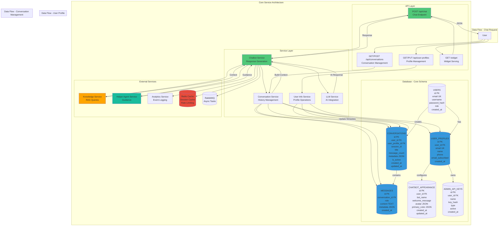

# Core Service - Detailed Architecture Diagram

## Overview
The Core Service is the main chatbot service handling conversations, user profiles, and widget serving.

## Database Schema Details

### USERS Table
- **Primary Key**: `id` (int)
- **Unique Key**: `email` (string)
- **Fields**: username, password_hash, role, created_at
- **Relationships**: One-to-many with USER_PROFILES, CONVERSATIONS

### USER_PROFILES Table
- **Primary Key**: `id` (int)
- **Foreign Key**: `user_id` → USERS.id
- **Unique Key**: `email` (string)
- **Fields**: name, phone, email_subscribed, created_at
- **Relationships**: One-to-many with CONVERSATIONS, CHATBOT_APPEARANCE

### CONVERSATIONS Table
- **Primary Key**: `id` (int)
- **Foreign Keys**: `user_id` → USERS.id, `user_profile_id` → USER_PROFILES.id
- **Fields**: session_id, title, message_count, metadata (JSON), is_active, created_at, updated_at
- **Relationships**: One-to-many with MESSAGES

### MESSAGES Table
- **Primary Key**: `id` (int)
- **Foreign Key**: `conversation_id` → CONVERSATIONS.id
- **Fields**: role (user/bot), content (TEXT), metadata (JSON), created_at
- **Indexes**: conversation_id, created_at

### CHATBOT_APPEARANCE Table
- **Primary Key**: `id` (int)
- **Foreign Key**: `user_id` → USERS.id
- **Fields**: bot_name, welcome_message, avatar (JSON), primary_color (JSON), created_at, updated_at

### ADMIN_API_KEYS Table
- **Primary Key**: `id` (int)
- **Foreign Key**: `user_id` → USERS.id
- **Fields**: name, key_hash, type, active, created_at

## Service Responsibilities

### Chatbot Service
- Generate chatbot responses using LLM
- Integrate RAG context from Knowledge Service
- Receive guidance from Helper Agent
- Format responses with markdown/HTML

### Conversation Service
- Create and manage conversations
- Store and retrieve message history
- Build conversation context for LLM
- Handle session management

### User Info Service
- Manage user profiles
- Store user information (name, email, phone)
- Link profiles to conversations
- Handle user metadata

## API Endpoints

### POST /api/chat
- **Input**: `message`, `conversation_id`, `session_id`, `api_key`
- **Output**: `response`, `conversation_id`, `is_new_conversation`
- **Flow**: Validate → Get Context → Generate Response → Store Message

### GET /api/conversations
- **Input**: `user_id` (from session)
- **Output**: List of conversations
- **Flow**: Query → Format → Return

### POST /api/conversations
- **Input**: `user_id`, `session_id`
- **Output**: `conversation_id`
- **Flow**: Create → Return ID

### GET /api/user-profiles
- **Input**: `user_id` (from session)
- **Output**: User profile data
- **Flow**: Query → Return

### PUT /api/user-profiles
- **Input**: `user_id`, `name`, `email`, `phone`
- **Output**: Updated profile
- **Flow**: Validate → Update → Return

### GET /widget
- **Input**: `api_key` (query param)
- **Output**: Widget HTML with configuration
- **Flow**: Validate API Key → Get Config → Render Widget

## Integration Points

### Knowledge Service
- **Purpose**: Retrieve relevant context for RAG
- **Method**: REST API call
- **Data**: Query → Context documents

### Helper Agent Service
- **Purpose**: Get conversation guidance
- **Method**: REST API call (async)
- **Data**: Conversation state → Guidance suggestions

### Analytics Service
- **Purpose**: Log conversation events
- **Method**: RabbitMQ message
- **Data**: Conversation events, metrics

### Redis Cache
- **Purpose**: Session cache, rate limiting
- **Data**: Session data, API key validation cache

### RabbitMQ
- **Purpose**: Async task processing
- **Data**: Analytics events, background tasks

