# Helper Agent Service - Detailed Architecture Diagram

## Overview
The Helper Agent Service is an invisible AI agent that analyzes ongoing conversations in real-time and provides guidance to the main chatbot based on successful conversation patterns.

```mermaid
graph TB
    subgraph "Helper Agent Service Architecture"
        subgraph "API Layer"
            AnalyzeAPI[POST /api/helper/analyze<br/>Real-time Analysis]
            GuidanceAPI[GET /api/helper/guidance<br/>Get Guidance]
            PatternsAPI[GET /api/helper/patterns<br/>Pattern Management]
            MatchAPI[POST /api/helper/match<br/>Pattern Matching]
        end
        
        subgraph "Service Layer"
            HelperAgentService[Helper Agent Service<br/>Core Analysis]
            AnalysisService[Analysis Service<br/>Conversation Analysis]
            PatternService[Pattern Service<br/>Pattern Recognition]
            GuidanceService[Guidance Service<br/>Guidance Generation]
            LearningService[Learning Service<br/>Pattern Learning]
        end
        
        subgraph "Database - Helper Agent Schema"
            ConversationPatterns[(CONVERSATION_PATTERNS<br/>id PK<br/>pattern_hash UK<br/>pattern_json JSON<br/>success_rate DECIMAL<br/>lead_generation_rate DECIMAL<br/>deal_closing_rate DECIMAL<br/>sample_size INT<br/>created_at TIMESTAMP<br/>updated_at TIMESTAMP)]
            PatternMatches[(PATTERN_MATCHES<br/>id PK<br/>pattern_id FK<br/>conversation_id FK<br/>match_score DECIMAL<br/>matched_at TIMESTAMP)]
            GuidanceHistory[(GUIDANCE_HISTORY<br/>id PK<br/>conversation_id FK<br/>guidance_type VARCHAR<br/>guidance_data JSON<br/>applied BOOLEAN<br/>outcome VARCHAR<br/>created_at TIMESTAMP)]
            ABTests[(AB_TESTS<br/>id PK<br/>test_name VARCHAR<br/>pattern_a_id FK<br/>pattern_b_id FK<br/>conversation_id FK<br/>variant VARCHAR<br/>outcome VARCHAR<br/>created_at TIMESTAMP)]
        end
        
        subgraph "External Services"
            AnalyticsService[Analytics Service<br/>Pattern Data]
            LLMService[LLM Service<br/>OpenAI/Anthropic<br/>Analysis & Guidance]
            RedisCache[(Redis Cache<br/>Real-time Analysis Cache<br/>Pattern Cache)]
            RabbitMQ[(RabbitMQ<br/>Analysis Queue)]
            CoreService[Core Service<br/>Conversation Events]
        end
    end
    
    subgraph "Data Flow - Real-time Analysis"
        CoreService -->|conversation.message| RabbitMQ
        RabbitMQ -->|Consume Event| AnalysisService
        
        AnalysisService --> RedisCache
        RedisCache -->|Check Cache| AnalysisService
        
        AnalysisService -->|Analyze Conversation| LLMService
        LLMService -->|Analysis Result| AnalysisService
        
        AnalysisService --> PatternService
        PatternService --> ConversationPatterns
        ConversationPatterns -->|Query Patterns| PatternService
        
        PatternService -->|Match Patterns| PatternMatches
        PatternMatches -->|Store Match| PatternService
        
        PatternService --> GuidanceService
        GuidanceService --> LLMService
        LLMService -->|Generate Guidance| GuidanceService
        
        GuidanceService --> GuidanceHistory
        GuidanceHistory -->|Store Guidance| GuidanceService
        
        GuidanceService -->|Return Guidance| AnalyzeAPI
        AnalyzeAPI -->|JSON Guidance| CoreService
    end
    
    subgraph "Data Flow - Pattern Learning"
        AnalyticsService -->|conversation.ended| RabbitMQ
        RabbitMQ -->|Consume Event| LearningService
        
        LearningService --> AnalyticsService
        AnalyticsService -->|Get Outcome| LearningService
        
        LearningService --> PatternService
        PatternService --> ConversationPatterns
        ConversationPatterns -->|Extract Pattern| PatternService
        
        PatternService -->|Hash Pattern| ConversationPatterns
        ConversationPatterns -->|Check Existing| PatternService
        
        PatternService -->|Create/Update Pattern| ConversationPatterns
        PatternService -->|Calculate Success Rates| ConversationPatterns
        
        LearningService -->|Update Patterns| PatternService
    end
    
    subgraph "Data Flow - Guidance Application"
        CoreService --> GuidanceAPI
        GuidanceAPI --> GuidanceService
        
        GuidanceService --> GuidanceHistory
        GuidanceHistory -->|Get Recent Guidance| GuidanceService
        
        GuidanceService --> PatternService
        PatternService --> ConversationPatterns
        ConversationPatterns -->|Get High-Success Patterns| PatternService
        
        GuidanceService -->|Combine Guidance| LLMService
        LLMService -->|Format Guidance| GuidanceService
        
        GuidanceService -->|Response| GuidanceAPI
        GuidanceAPI -->|Guidance JSON| CoreService
    end
    
    subgraph "Data Flow - A/B Testing"
        GuidanceService --> ABTests
        ABTests -->|Select Variant| GuidanceService
        
        GuidanceService -->|Apply Variant A| CoreService
        GuidanceService -->|Apply Variant B| CoreService
        
        CoreService -->|Track Outcome| ABTests
        ABTests -->|Store Result| GuidanceService
        
        GuidanceService -->|Analyze Results| PatternService
        PatternService -->|Update Pattern Success| ConversationPatterns
    end
    
    ConversationPatterns -->|generates| PatternMatches
    ConversationPatterns -->|used_in| ABTests
    GuidanceHistory -->|references| ConversationPatterns
    
    style HelperAgentService fill:#1abc9c
    style ConversationPatterns fill:#3498db
    style PatternMatches fill:#3498db
    style GuidanceHistory fill:#3498db
    style LLMService fill:#1abc9c
    style RedisCache fill:#e74c3c
    style AnalyticsService fill:#9b59b6
    style RabbitMQ fill:#f39c12
```



## Database Schema Details

### CONVERSATION_PATTERNS Table
- **Primary Key**: `id` (int)
- **Unique Key**: `pattern_hash` (string) - SHA256 hash of pattern JSON
- **Fields**: pattern_json (JSON), success_rate (DECIMAL), lead_generation_rate (DECIMAL), deal_closing_rate (DECIMAL), sample_size (INT), created_at, updated_at
- **Indexes**: pattern_hash (unique), success_rate, sample_size, updated_at
- **Pattern Format**: JSON structure representing conversation flow, topics, tone, etc.

### PATTERN_MATCHES Table
- **Primary Key**: `id` (int)
- **Foreign Keys**: `pattern_id` → CONVERSATION_PATTERNS.id, `conversation_id` → CONVERSATIONS.id
- **Fields**: match_score (DECIMAL 0-1), matched_at (TIMESTAMP)
- **Indexes**: pattern_id, conversation_id, match_score, matched_at
- **Purpose**: Track which patterns matched which conversations

### GUIDANCE_HISTORY Table
- **Primary Key**: `id` (int)
- **Foreign Key**: `conversation_id` → CONVERSATIONS.id
- **Fields**: guidance_type (VARCHAR), guidance_data (JSON), applied (BOOLEAN), outcome (VARCHAR), created_at
- **Indexes**: conversation_id, guidance_type, applied, outcome, created_at
- **Guidance Types**: next_question, topic_suggestion, tone_adjustment, etc.

### AB_TESTS Table
- **Primary Key**: `id` (int)
- **Foreign Keys**: `pattern_a_id` → CONVERSATION_PATTERNS.id, `pattern_b_id` → CONVERSATION_PATTERNS.id, `conversation_id` → CONVERSATIONS.id
- **Fields**: test_name, variant (A or B), outcome (VARCHAR), created_at
- **Indexes**: test_name, pattern_a_id, pattern_b_id, outcome
- **Purpose**: Track A/B test results for pattern effectiveness

## Service Responsibilities

### Helper Agent Service
- Coordinate real-time analysis
- Manage guidance generation
- Handle pattern matching
- Coordinate with other services

### Analysis Service
- Analyze ongoing conversations in real-time
- Extract conversation features
- Identify conversation state
- Cache analysis results

### Pattern Service
- Match conversations to patterns
- Calculate pattern similarity scores
- Retrieve high-success patterns
- Update pattern statistics

### Guidance Service
- Generate actionable guidance
- Format guidance for chatbot
- Track guidance application
- Measure guidance effectiveness

### Learning Service
- Learn from conversation outcomes
- Extract new patterns
- Update pattern success rates
- Improve pattern recognition

## Pattern Recognition

### Pattern Extraction
- **Input**: Completed conversation with outcome
- **Process**: Extract features (topics, tone, flow, questions asked)
- **Output**: Pattern JSON structure
- **Hash**: SHA256 of pattern JSON for deduplication

### Pattern Matching
- **Method**: Similarity scoring (cosine similarity, edit distance)
- **Threshold**: Match score > 0.7 considered a match
- **Real-time**: Match ongoing conversations to patterns
- **Caching**: Cache pattern matches in Redis

### Success Rate Calculation
```
success_rate = (successful_conversations / total_matches) * 100
lead_generation_rate = (leads_generated / total_matches) * 100
deal_closing_rate = (deals_closed / total_matches) * 100
```

## Guidance Types

### Next Question Suggestion
- **Purpose**: Suggest the next question to ask
- **Format**: `{"type": "next_question", "question": "...", "reason": "..."}`
- **Usage**: Chatbot can use this to guide conversation

### Topic Suggestion
- **Purpose**: Suggest topics to discuss
- **Format**: `{"type": "topic", "topics": ["...", "..."], "priority": "high"}`
- **Usage**: Guide conversation toward successful topics

### Tone Adjustment
- **Purpose**: Adjust conversation tone
- **Format**: `{"type": "tone", "tone": "friendly", "reason": "..."}`
- **Usage**: Match tone of successful conversations

### Response Template
- **Purpose**: Suggest response templates
- **Format**: `{"type": "template", "template": "...", "variables": {...}}`
- **Usage**: Provide proven response patterns

## API Endpoints

### POST /api/helper/analyze
- **Input**: `conversation_id`, `current_message`, `conversation_history`
- **Output**: `analysis`, `matched_patterns`, `guidance`
- **Flow**: Analyze → Match Patterns → Generate Guidance → Return

### GET /api/helper/guidance
- **Input**: `conversation_id`
- **Output**: `guidance` (next question, topics, tone, etc.)
- **Flow**: Get Recent Guidance → Get Patterns → Generate → Return

### GET /api/helper/patterns
- **Input**: `min_success_rate` (optional), `min_sample_size` (optional)
- **Output**: List of high-success patterns
- **Flow**: Query → Filter → Sort → Return

### POST /api/helper/match
- **Input**: `conversation_id`, `pattern_id`
- **Output**: `match_score`, `matched`
- **Flow**: Calculate Similarity → Store Match → Return

## Integration Points

### Analytics Service
- **Purpose**: Get pattern data and conversation outcomes
- **Method**: REST API call
- **Data**: Pattern statistics, conversation outcomes

### LLM Service
- **Purpose**: Analyze conversations and generate guidance
- **Method**: REST API call
- **Data**: Conversation context → Analysis → Guidance

### Redis Cache
- **Purpose**: Cache real-time analysis, pattern matches
- **TTL**: 5 minutes for analysis, 1 hour for patterns
- **Data**: Analysis results, pattern cache, guidance cache

### RabbitMQ
- **Purpose**: Consume conversation events
- **Events**: `conversation.message`, `conversation.ended`
- **Queues**: `helper_analysis`, `pattern_learning`

### Core Service
- **Purpose**: Receive guidance and apply it
- **Method**: REST API call
- **Data**: Guidance → Apply to conversation

## A/B Testing Framework

### Test Setup
- **Pattern A**: Control pattern (current approach)
- **Pattern B**: New pattern to test
- **Split**: 50/50 or configurable ratio
- **Duration**: Until statistical significance

### Test Execution
- **Assignment**: Randomly assign conversations to variants
- **Tracking**: Track which variant was used
- **Outcome**: Measure success rates for each variant
- **Analysis**: Compare outcomes, determine winner

### Test Results
- **Metrics**: Success rate, lead generation, deal closing
- **Statistical Significance**: Chi-square test
- **Decision**: Adopt winning pattern or continue testing

