# Knowledge Service - Detailed Architecture Diagram

## Overview
The Knowledge Service manages knowledge base operations including file uploads, FAQ management, web crawling, and vector search using ChromaDB.

```mermaid
graph TB
    subgraph "Knowledge Service Architecture"
        subgraph "API Layer"
            FilesAPI[POST /api/knowledge/files<br/>Upload File]
            FilesListAPI[GET /api/knowledge/files<br/>List Files]
            FilesDeleteAPI[DELETE /api/knowledge/files/:id<br/>Delete File]
            FAQsAPI[GET/POST /api/knowledge/faqs<br/>FAQ Management]
            CrawlAPI[POST /api/knowledge/crawl<br/>Web Crawling]
            SearchAPI[POST /api/knowledge/search<br/>Vector Search]
        end
        
        subgraph "Service Layer"
            FileService[File Service<br/>File Processing]
            FAQService[FAQ Service<br/>FAQ Management]
            CrawlService[Crawl Service<br/>Web Crawling]
            EmbeddingService[Embedding Service<br/>Vector Generation]
            VectorService[Vector Service<br/>ChromaDB Operations]
        end
        
        subgraph "Database - Knowledge Schema"
            Files[(FILES<br/>id PK<br/>user_id FK<br/>filename<br/>file_path<br/>file_size<br/>file_type<br/>chromadb_collection_id<br/>status<br/>metadata JSON<br/>created_at<br/>updated_at)]
            FileChunks[(FILE_CHUNKS<br/>id PK<br/>file_id FK<br/>chunk_index<br/>chunk_text TEXT<br/>chunk_metadata JSON<br/>created_at)]
            FAQs[(FAQS<br/>id PK<br/>user_id FK<br/>question TEXT<br/>answer TEXT<br/>category<br/>priority<br/>metadata JSON<br/>created_at<br/>updated_at)]
            FAQCategories[(FAQ_CATEGORIES<br/>id PK<br/>faq_id FK<br/>category<br/>created_at)]
            Crawls[(CRAWLS<br/>id PK<br/>user_id FK<br/>url<br/>status<br/>pages_crawled<br/>metadata JSON<br/>created_at<br/>updated_at)]
            CrawlPages[(CRAWL_PAGES<br/>id PK<br/>crawl_id FK<br/>url<br/>title<br/>content TEXT<br/>status<br/>created_at)]
        end
        
        subgraph "ChromaDB Vector Database"
            ChromaDB[(ChromaDB Instance)]
            UserCollections[User Collections<br/>Collection: user_1<br/>Collection: user_2<br/>Collection: user_N]
            VectorIndexes[FAISS Indexes<br/>Per-User Optimized]
        end
        
        subgraph "External Services"
            StorageService[Object Storage<br/>MinIO/S3<br/>File Storage]
            EmbeddingModel[Embedding Model<br/>OpenAI text-embedding-3-small<br/>1536 dimensions]
            RabbitMQ[(RabbitMQ<br/>Async Processing)]
            CoreService[Core Service<br/>RAG Queries]
        end
    end
    
    subgraph "Data Flow - File Upload"
        User[User] --> FilesAPI
        FilesAPI --> FileService
        FileService --> StorageService
        StorageService -->|Store File| FileService
        
        FileService --> Files
        FileService -->|Chunk Document| FileChunks
        
        FileService --> EmbeddingService
        EmbeddingService --> EmbeddingModel
        EmbeddingModel -->|Generate Embeddings| EmbeddingService
        
        EmbeddingService --> VectorService
        VectorService --> ChromaDB
        ChromaDB -->|Get/Create Collection| UserCollections
        UserCollections -->|Add Vectors| VectorService
        VectorService -->|Index| VectorIndexes
        
        VectorService --> Files
        Files -->|Update collection_id| FileService
        FileService -->|Response| FilesAPI
        FilesAPI -->|Success| User
    end
    
    subgraph "Data Flow - RAG Query"
        CoreService --> SearchAPI
        SearchAPI --> VectorService
        VectorService -->|Get Collection| ChromaDB
        ChromaDB --> UserCollections
        
        SearchAPI --> EmbeddingService
        EmbeddingService --> EmbeddingModel
        EmbeddingModel -->|Embed Query| EmbeddingService
        
        EmbeddingService --> VectorService
        VectorService --> VectorIndexes
        VectorIndexes -->|Similarity Search<br/>k=30| VectorService
        VectorService -->|Top K Documents| SearchAPI
        
        SearchAPI --> Files
        Files -->|Get Metadata| SearchAPI
        SearchAPI -->|Context + Metadata| CoreService
    end
    
    subgraph "Data Flow - FAQ Management"
        User --> FAQsAPI
        FAQsAPI --> FAQService
        FAQService --> FAQs
        FAQService --> FAQCategories
        
        FAQService --> EmbeddingService
        EmbeddingService --> EmbeddingModel
        EmbeddingModel -->|Generate Embeddings| EmbeddingService
        
        EmbeddingService --> VectorService
        VectorService --> ChromaDB
        ChromaDB --> UserCollections
        UserCollections -->|Add FAQ Vectors| VectorService
        
        FAQService -->|Response| FAQsAPI
        FAQsAPI -->|Success| User
    end
    
    subgraph "Data Flow - Web Crawling"
        User --> CrawlAPI
        CrawlAPI --> CrawlService
        CrawlService --> Crawls
        CrawlService -->|Fetch Pages| ExternalSite[External Website]
        ExternalSite -->|HTML Content| CrawlService
        
        CrawlService -->|Parse & Extract| CrawlPages
        CrawlPages --> CrawlService
        
        CrawlService --> EmbeddingService
        EmbeddingService --> EmbeddingModel
        EmbeddingModel -->|Generate Embeddings| EmbeddingService
        
        EmbeddingService --> VectorService
        VectorService --> ChromaDB
        ChromaDB --> UserCollections
        UserCollections -->|Add Crawl Vectors| VectorService
        
        CrawlService --> RabbitMQ
        RabbitMQ -->|Async Processing| CrawlService
        
        CrawlService -->|Response| CrawlAPI
        CrawlAPI -->|Success| User
    end
    
    Files -->|contains| FileChunks
    FAQs -->|categorized_by| FAQCategories
    Crawls -->|contains| CrawlPages
    Files -.->|indexed_in| UserCollections
    
    style FilesAPI fill:#ffa500
    style FileService fill:#ffa500
    style Files fill:#3498db
    style ChromaDB fill:#9b59b6
    style UserCollections fill:#9b59b6
    style VectorIndexes fill:#3498db
    style EmbeddingModel fill:#1abc9c
    style StorageService fill:#f39c12
```

## Database Schema Details

### FILES Table
- **Primary Key**: `id` (int)
- **Foreign Key**: `user_id` → USERS.id
- **Fields**: filename, file_path, file_size, file_type, chromadb_collection_id, status, metadata (JSON), created_at, updated_at
- **Indexes**: user_id, chromadb_collection_id, status
- **Status Values**: processing, completed, failed

### FILE_CHUNKS Table
- **Primary Key**: `id` (int)
- **Foreign Key**: `file_id` → FILES.id
- **Fields**: chunk_index, chunk_text (TEXT), chunk_metadata (JSON), created_at
- **Indexes**: file_id, chunk_index
- **Chunking Strategy**: 1000 chars with 200 char overlap

### FAQs Table
- **Primary Key**: `id` (int)
- **Foreign Key**: `user_id` → USERS.id
- **Fields**: question (TEXT), answer (TEXT), category, priority, metadata (JSON), created_at, updated_at
- **Indexes**: user_id, category, priority

### FAQ_CATEGORIES Table
- **Primary Key**: `id` (int)
- **Foreign Key**: `faq_id` → FAQs.id
- **Fields**: category, created_at
- **Indexes**: faq_id, category

### CRAWLS Table
- **Primary Key**: `id` (int)
- **Foreign Key**: `user_id` → USERS.id
- **Fields**: url, status, pages_crawled, metadata (JSON), created_at, updated_at
- **Indexes**: user_id, status, url
- **Status Values**: pending, crawling, completed, failed

### CRAWL_PAGES Table
- **Primary Key**: `id` (int)
- **Foreign Key**: `crawl_id` → CRAWLS.id
- **Fields**: url, title, content (TEXT), status, created_at
- **Indexes**: crawl_id, url, status

## ChromaDB Structure

### Collection Naming
- **Format**: `user_{user_id}`
- **Example**: `user_1`, `user_2`, `user_123`
- **Namespace**: `default`
- **Isolation**: Complete per-user isolation

### Collection Structure
- **Documents**: Chunked text from files, FAQs, crawls
- **Embeddings**: 1536-dimensional vectors (OpenAI text-embedding-3-small)
- **Metadata**: 
  - `source_type`: file_upload, faq, crawl
  - `source_id`: File/FAQ/Crawl ID
  - `chunk_index`: For file chunks
  - `timestamp`: Creation time

### Vector Index
- **Type**: FAISS (Flat or IVF)
- **Optimization**: Per-user index for fast similarity search
- **Search Parameters**: k=30 (top 30 results)

## Service Responsibilities

### File Service
- Accept file uploads (PDF, DOCX, TXT, MD)
- Store files in object storage
- Chunk documents for processing
- Track file processing status
- Link files to ChromaDB collections

### FAQ Service
- Manage FAQ entries
- Categorize FAQs
- Generate embeddings for FAQs
- Store FAQs in ChromaDB

### Crawl Service
- Crawl websites (single page or sitemap)
- Extract and clean content
- Parse HTML to text
- Track crawl progress
- Store crawled pages

### Embedding Service
- Generate embeddings using OpenAI API
- Batch processing for efficiency
- Handle embedding errors
- Cache embeddings when possible

### Vector Service
- Manage ChromaDB collections
- Add documents to collections
- Perform similarity searches
- Maintain vector indexes
- Handle collection isolation

## API Endpoints

### POST /api/knowledge/files
- **Input**: `file` (multipart), `user_id`
- **Output**: `file_id`, `status`, `chromadb_collection_id`
- **Flow**: Upload → Store → Chunk → Embed → Index → Return

### GET /api/knowledge/files
- **Input**: `user_id` (from session)
- **Output**: List of files with metadata
- **Flow**: Query → Format → Return

### DELETE /api/knowledge/files/:id
- **Input**: `file_id`, `user_id`
- **Output**: Success message
- **Flow**: Validate → Delete from Storage → Delete from DB → Remove from ChromaDB → Return

### GET /api/knowledge/faqs
- **Input**: `user_id`, `category` (optional)
- **Output**: List of FAQs
- **Flow**: Query → Format → Return

### POST /api/knowledge/faqs
- **Input**: `user_id`, `question`, `answer`, `category`
- **Output**: `faq_id`
- **Flow**: Validate → Store → Embed → Index → Return

### POST /api/knowledge/crawl
- **Input**: `user_id`, `url`, `max_pages` (optional)
- **Output**: `crawl_id`, `status`
- **Flow**: Validate → Create Crawl → Queue Task → Return

### POST /api/knowledge/search
- **Input**: `user_id`, `query`, `k` (default: 30)
- **Output**: List of relevant documents with scores
- **Flow**: Embed Query → Search Collection → Get Metadata → Return

## Integration Points

### Object Storage (MinIO/S3)
- **Purpose**: Store uploaded files
- **Structure**: `{user_id}/files/{file_id}/{filename}`
- **Access**: Signed URLs for temporary access

### Embedding Model (OpenAI)
- **Model**: text-embedding-3-small
- **Dimensions**: 1536
- **Rate Limits**: Handle with retries and backoff
- **Cost**: Track usage per user

### ChromaDB
- **Purpose**: Vector storage and search
- **Collections**: Per-user isolation
- **Operations**: Add, query, delete
- **Performance**: Optimized indexes per collection

### RabbitMQ
- **Purpose**: Async file processing, crawling
- **Queues**: `file_processing`, `crawl_processing`
- **Events**: `file.processed`, `crawl.completed`

### Core Service
- **Purpose**: RAG queries for chat
- **Method**: REST API call
- **Data**: Query → Context documents

