# LangGraph Service - Detailed Architecture Diagram

## Overview
The LangGraph Service handles advanced AI workflows, appointment scheduling, task automation, and multi-agent orchestration.

```mermaid
graph TB
    subgraph "LangGraph Service Architecture"
        subgraph "API Layer"
            WorkflowsAPI[GET/POST /api/langgraph/workflows<br/>Workflow Management]
            ScheduleAPI[POST /api/langgraph/schedule<br/>Appointment Scheduling]
            TasksAPI[GET/POST /api/langgraph/tasks<br/>Task Management]
            ExecuteAPI[POST /api/langgraph/execute<br/>Execute Workflow]
        end
        
        subgraph "Service Layer"
            LangGraphService[LangGraph Service<br/>Workflow Orchestration]
            WorkflowService[Workflow Service<br/>Workflow Management]
            ScheduleService[Schedule Service<br/>Calendar Integration]
            TaskService[Task Service<br/>Task Automation]
            AgentService[Agent Service<br/>Multi-Agent Coordination]
        end
        
        subgraph "Database - LangGraph Schema"
            Workflows[(WORKFLOWS<br/>id PK<br/>user_id FK<br/>name VARCHAR<br/>workflow_type VARCHAR<br/>state JSON<br/>status VARCHAR<br/>created_at TIMESTAMP<br/>updated_at TIMESTAMP)]
            WorkflowSteps[(WORKFLOW_STEPS<br/>id PK<br/>workflow_id FK<br/>step_name VARCHAR<br/>step_type VARCHAR<br/>step_config JSON<br/>step_result JSON<br/>status VARCHAR<br/>executed_at TIMESTAMP)]
            Appointments[(APPOINTMENTS<br/>id PK<br/>workflow_id FK<br/>user_id FK<br/>title VARCHAR<br/>description TEXT<br/>start_time TIMESTAMP<br/>end_time TIMESTAMP<br/>calendar_id VARCHAR<br/>event_id VARCHAR<br/>status VARCHAR<br/>created_at TIMESTAMP)]
            Tasks[(TASKS<br/>id PK<br/>workflow_id FK<br/>task_type VARCHAR<br/>task_config JSON<br/>status VARCHAR<br/>result JSON<br/>scheduled_at TIMESTAMP<br/>executed_at TIMESTAMP)]
        end
        
        subgraph "External Services"
            GoogleCalendar[Google Calendar API<br/>Appointment Scheduling]
            OutlookCalendar[Outlook Calendar API<br/>Alternative Provider]
            LLMService[LLM Service<br/>OpenAI/Anthropic<br/>Workflow Decisions]
            RabbitMQ[(RabbitMQ<br/>Task Queue)]
            CoreService[Core Service<br/>Workflow Triggers]
        end
    end
    
    subgraph "Data Flow - Workflow Execution"
        User[User] --> ExecuteAPI
        ExecuteAPI --> LangGraphService
        
        LangGraphService --> WorkflowService
        WorkflowService --> Workflows
        Workflows -->|Get Workflow| WorkflowService
        
        LangGraphService --> AgentService
        AgentService --> LLMService
        LLMService -->|AI Decision| AgentService
        
        AgentService --> WorkflowSteps
        WorkflowSteps -->|Store Step| AgentService
        
        AgentService --> ScheduleService
        ScheduleService --> GoogleCalendar
        GoogleCalendar -->|Create Event| ScheduleService
        ScheduleService --> Appointments
        
        AgentService --> TaskService
        TaskService --> Tasks
        TaskService --> RabbitMQ
        RabbitMQ -->|Async Task| TaskService
        
        LangGraphService -->|Response| ExecuteAPI
        ExecuteAPI -->|Workflow Result| User
    end
    
    subgraph "Data Flow - Appointment Scheduling"
        User --> ScheduleAPI
        ScheduleAPI --> ScheduleService
        
        ScheduleService --> LLMService
        LLMService -->|Find Available Slots| ScheduleService
        
        ScheduleService --> GoogleCalendar
        GoogleCalendar -->|Check Availability| ScheduleService
        ScheduleService -->|Create Appointment| GoogleCalendar
        GoogleCalendar -->|Event Created| ScheduleService
        
        ScheduleService --> Appointments
        Appointments -->|Store| ScheduleService
        
        ScheduleService -->|Response| ScheduleAPI
        ScheduleAPI -->|Appointment Details| User
    end
    
    subgraph "Data Flow - Task Automation"
        WorkflowService --> TaskService
        TaskService --> Tasks
        Tasks -->|Get Task| TaskService
        
        TaskService --> RabbitMQ
        RabbitMQ -->|Consume Task| TaskService
        
        TaskService -->|Execute Task| ExternalAPI[External APIs<br/>Email, SMS, etc.]
        ExternalAPI -->|Result| TaskService
        
        TaskService --> Tasks
        Tasks -->|Update Status| TaskService
        
        TaskService --> WorkflowService
        WorkflowService -->|Update Workflow| Workflows
    end
    
    subgraph "Data Flow - Multi-Agent Orchestration"
        LangGraphService --> AgentService
        AgentService -->|Coordinate| Agent1[Agent 1<br/>Research]
        AgentService -->|Coordinate| Agent2[Agent 2<br/>Analysis]
        AgentService -->|Coordinate| Agent3[Agent 3<br/>Decision]
        
        Agent1 --> LLMService
        Agent2 --> LLMService
        Agent3 --> LLMService
        
        LLMService -->|Results| Agent1
        LLMService -->|Results| Agent2
        LLMService -->|Results| Agent3
        
        Agent1 -->|Output| AgentService
        Agent2 -->|Output| AgentService
        Agent3 -->|Output| AgentService
        
        AgentService -->|Combine Results| LangGraphService
        LangGraphService -->|Final Output| Workflows
    end
    
    Workflows -->|contains| WorkflowSteps
    Workflows -->|schedules| Appointments
    Workflows -->|creates| Tasks
    
    style LangGraphService fill:#3498db
    style Workflows fill:#3498db
    style Appointments fill:#3498db
    style GoogleCalendar fill:#4285f4
    style LLMService fill:#1abc9c
    style AgentService fill:#9b59b6
    style RabbitMQ fill:#f39c12
```

## Database Schema Details

### WORKFLOWS Table
- **Primary Key**: `id` (int)
- **Foreign Key**: `user_id` → USERS.id
- **Fields**: name, workflow_type, state (JSON), status, created_at, updated_at
- **Indexes**: user_id, workflow_type, status, created_at
- **Status Values**: pending, running, completed, failed, cancelled
- **Workflow Types**: appointment_scheduling, research_task, data_analysis, etc.

### WORKFLOW_STEPS Table
- **Primary Key**: `id` (int)
- **Foreign Key**: `workflow_id` → WORKFLOWS.id
- **Fields**: step_name, step_type, step_config (JSON), step_result (JSON), status, executed_at
- **Indexes**: workflow_id, step_name, status
- **Step Types**: llm_call, api_call, calendar_action, task_execution

### APPOINTMENTS Table
- **Primary Key**: `id` (int)
- **Foreign Keys**: `workflow_id` → WORKFLOWS.id, `user_id` → USERS.id
- **Fields**: title, description (TEXT), start_time, end_time, calendar_id, event_id, status, created_at
- **Indexes**: workflow_id, user_id, start_time, calendar_id, event_id
- **Status Values**: scheduled, confirmed, cancelled, completed

### TASKS Table
- **Primary Key**: `id` (int)
- **Foreign Key**: `workflow_id` → WORKFLOWS.id
- **Fields**: task_type, task_config (JSON), status, result (JSON), scheduled_at, executed_at
- **Indexes**: workflow_id, task_type, status, scheduled_at
- **Task Types**: send_email, send_sms, create_document, api_call, etc.

## Service Responsibilities

### LangGraph Service
- Orchestrate workflow execution
- Manage workflow state
- Coordinate between agents
- Handle workflow errors and retries

### Workflow Service
- Create and manage workflows
- Store workflow definitions
- Track workflow execution
- Handle workflow lifecycle

### Schedule Service
- Integrate with calendar providers
- Find available time slots
- Create and manage appointments
- Handle calendar synchronization

### Task Service
- Execute automated tasks
- Queue tasks for async processing
- Track task execution
- Handle task failures

### Agent Service
- Coordinate multiple AI agents
- Manage agent communication
- Combine agent outputs
- Handle agent failures

## Calendar Integration

### Google Calendar
- **API**: Google Calendar API v3
- **Authentication**: OAuth 2.0
- **Operations**: Create, Read, Update, Delete events
- **Features**: Availability checking, recurring events, reminders

### Outlook Calendar
- **API**: Microsoft Graph API
- **Authentication**: OAuth 2.0
- **Operations**: Similar to Google Calendar
- **Features**: Meeting scheduling, availability

## API Endpoints

### GET /api/langgraph/workflows
- **Input**: `user_id`, `status` (optional)
- **Output**: List of workflows
- **Flow**: Query → Format → Return

### POST /api/langgraph/workflows
- **Input**: `user_id`, `name`, `workflow_type`, `workflow_config`
- **Output**: `workflow_id`
- **Flow**: Validate → Create → Return

### POST /api/langgraph/execute
- **Input**: `workflow_id`, `input_data`
- **Output**: `workflow_result`, `status`
- **Flow**: Load Workflow → Execute → Store Steps → Return

### POST /api/langgraph/schedule
- **Input**: `user_id`, `title`, `description`, `preferred_times`, `duration`
- **Output**: `appointment_id`, `start_time`, `end_time`
- **Flow**: Find Slots → Create Event → Store → Return

### GET /api/langgraph/tasks
- **Input**: `workflow_id`, `status` (optional)
- **Output**: List of tasks
- **Flow**: Query → Format → Return

### POST /api/langgraph/tasks
- **Input**: `workflow_id`, `task_type`, `task_config`
- **Output**: `task_id`
- **Flow**: Validate → Create → Queue → Return

## Integration Points

### LLM Service
- **Purpose**: AI decision-making in workflows
- **Method**: REST API call
- **Data**: Workflow context → AI decision → Next step

### Google Calendar API
- **Purpose**: Appointment scheduling
- **Method**: REST API
- **Operations**: Check availability, create events, update events

### Outlook Calendar API
- **Purpose**: Alternative calendar provider
- **Method**: Microsoft Graph API
- **Operations**: Similar to Google Calendar

### RabbitMQ
- **Purpose**: Async task execution
- **Queue**: `langgraph_tasks`
- **Events**: `task.completed`, `task.failed`, `workflow.completed`

### Core Service
- **Purpose**: Trigger workflows from chat
- **Method**: REST API call
- **Data**: User request → Workflow trigger → Result

## Workflow Types

### Appointment Scheduling
- **Steps**: Find available slots → Confirm with user → Create calendar event → Send confirmation
- **Agents**: Calendar agent, Confirmation agent

### Research Task
- **Steps**: Research topic → Analyze data → Generate report → Send results
- **Agents**: Research agent, Analysis agent, Report agent

### Data Analysis
- **Steps**: Collect data → Analyze → Generate insights → Create visualization
- **Agents**: Data agent, Analysis agent, Visualization agent

