# Marketing Service - Detailed Architecture Diagram

## Overview
The Marketing Service manages email marketing campaigns, subscriber management, email templates, and campaign analytics.

```mermaid
graph TB
    subgraph "Marketing Service Architecture"
        subgraph "API Layer"
            SubscribeAPI[POST /api/marketing/subscribe<br/>Subscribe User]
            UnsubscribeAPI[POST /api/marketing/unsubscribe<br/>Unsubscribe]
            CampaignsAPI[GET/POST /api/marketing/campaigns<br/>Campaign Management]
            TemplatesAPI[GET/POST /api/marketing/templates<br/>Template Management]
            AnalyticsAPI[GET /api/marketing/analytics<br/>Campaign Analytics]
        end
        
        subgraph "Service Layer"
            MarketingService[Marketing Service<br/>Core Marketing Logic]
            CampaignService[Campaign Service<br/>Campaign Management]
            TemplateService[Template Service<br/>Email Templates]
            EmailService[Email Service<br/>Email Sending]
            SubscriptionService[Subscription Service<br/>Subscriber Management]
        end
        
        subgraph "Database - Marketing Schema"
            MarketingSubscriptions[(MARKETING_SUBSCRIPTIONS<br/>id PK<br/>user_profile_id FK<br/>email UK<br/>subscribed BOOLEAN<br/>subscribed_at TIMESTAMP<br/>unsubscribed_at TIMESTAMP<br/>source VARCHAR<br/>metadata JSON)]
            Campaigns[(CAMPAIGNS<br/>id PK<br/>name VARCHAR<br/>subject VARCHAR<br/>template_id FK<br/>status VARCHAR<br/>scheduled_at TIMESTAMP<br/>sent_at TIMESTAMP<br/>sent_count INT<br/>open_count INT<br/>click_count INT<br/>created_at TIMESTAMP)]
            EmailTemplates[(EMAIL_TEMPLATES<br/>id PK<br/>campaign_id FK<br/>name VARCHAR<br/>subject VARCHAR<br/>body_html TEXT<br/>body_text TEXT<br/>variables JSON<br/>created_at TIMESTAMP<br/>updated_at TIMESTAMP)]
            CampaignAnalytics[(CAMPAIGN_ANALYTICS<br/>id PK<br/>campaign_id FK<br/>subscriber_id FK<br/>email_sent BOOLEAN<br/>email_opened BOOLEAN<br/>email_clicked BOOLEAN<br/>opened_at TIMESTAMP<br/>clicked_at TIMESTAMP<br/>unsubscribed BOOLEAN<br/>created_at TIMESTAMP)]
        end
        
        subgraph "External Services"
            EmailProvider[Email Provider<br/>SendGrid/Mailchimp<br/>SMTP]
            RabbitMQ[(RabbitMQ<br/>Email Queue)]
            CoreService[Core Service<br/>Subscription Events]
            AnalyticsService[Analytics Service<br/>Campaign Metrics]
        end
    end
    
    subgraph "Data Flow - User Subscription"
        User[User via Chatbot] -->|Input Email| CoreService
        CoreService -->|user.subscribed| RabbitMQ
        RabbitMQ -->|Consume Event| SubscriptionService
        
        SubscriptionService --> MarketingSubscriptions
        MarketingSubscriptions -->|Create/Update| SubscriptionService
        
        SubscriptionService -->|Response| SubscribeAPI
        SubscribeAPI -->|Success| User
    end
    
    subgraph "Data Flow - Campaign Creation"
        Admin[Admin User] --> CampaignsAPI
        CampaignsAPI --> CampaignService
        
        CampaignService --> Campaigns
        CampaignService --> TemplateService
        TemplateService --> EmailTemplates
        
        CampaignService -->|Schedule| RabbitMQ
        RabbitMQ -->|Email Queue| EmailService
        
        CampaignService -->|Response| CampaignsAPI
        CampaignsAPI -->|Campaign ID| Admin
    end
    
    subgraph "Data Flow - Email Sending"
        RabbitMQ -->|Consume Email Task| EmailService
        EmailService --> MarketingSubscriptions
        MarketingSubscriptions -->|Get Subscribers| EmailService
        
        EmailService --> TemplateService
        TemplateService --> EmailTemplates
        EmailTemplates -->|Get Template| EmailService
        
        EmailService -->|Render Template| EmailService
        EmailService --> EmailProvider
        EmailProvider -->|Send Email| Recipient[Email Recipient]
        
        EmailService --> CampaignAnalytics
        CampaignAnalytics -->|Log Sent| EmailService
        
        EmailService -->|Track| AnalyticsService
    end
    
    subgraph "Data Flow - Email Tracking"
        Recipient -->|Open Email| EmailProvider
        EmailProvider -->|Webhook| EmailService
        EmailService --> CampaignAnalytics
        CampaignAnalytics -->|Update opened| EmailService
        
        Recipient -->|Click Link| EmailProvider
        EmailProvider -->|Webhook| EmailService
        EmailService --> CampaignAnalytics
        CampaignAnalytics -->|Update clicked| EmailService
        
        EmailService --> AnalyticsService
        AnalyticsService -->|Update Metrics| Campaigns
    end
    
    subgraph "Data Flow - Unsubscribe"
        Recipient -->|Unsubscribe Link| UnsubscribeAPI
        UnsubscribeAPI --> SubscriptionService
        SubscriptionService --> MarketingSubscriptions
        MarketingSubscriptions -->|Update subscribed=false| SubscriptionService
        
        SubscriptionService --> CampaignAnalytics
        CampaignAnalytics -->|Log Unsubscribed| SubscriptionService
        
        SubscriptionService -->|Response| UnsubscribeAPI
        UnsubscribeAPI -->|Confirmation| Recipient
    end
    
    MarketingSubscriptions -->|receives| Campaigns
    Campaigns -->|uses| EmailTemplates
    Campaigns -->|tracks| CampaignAnalytics
    
    style MarketingService fill:#e74c3c
    style MarketingSubscriptions fill:#3498db
    style Campaigns fill:#3498db
    style EmailTemplates fill:#3498db
    style EmailProvider fill:#f39c12
    style RabbitMQ fill:#f39c12
```



## Database Schema Details

### MARKETING_SUBSCRIPTIONS Table
- **Primary Key**: `id` (int)
- **Foreign Key**: `user_profile_id` → USER_PROFILES.id
- **Unique Key**: `email` (string)
- **Fields**: subscribed (BOOLEAN), subscribed_at, unsubscribed_at, source (VARCHAR), metadata (JSON)
- **Indexes**: email (unique), user_profile_id, subscribed, subscribed_at
- **Source Values**: chatbot_form, manual, import

### CAMPAIGNS Table
- **Primary Key**: `id` (int)
- **Foreign Key**: `template_id` → EMAIL_TEMPLATES.id
- **Fields**: name, subject, status, scheduled_at, sent_at, sent_count, open_count, click_count, created_at
- **Indexes**: template_id, status, scheduled_at, sent_at
- **Status Values**: draft, scheduled, sending, sent, paused, cancelled

### EMAIL_TEMPLATES Table
- **Primary Key**: `id` (int)
- **Foreign Key**: `campaign_id` → CAMPAIGNS.id (nullable)
- **Fields**: name, subject, body_html (TEXT), body_text (TEXT), variables (JSON), created_at, updated_at
- **Indexes**: campaign_id, name
- **Template Variables**: {{name}}, {{email}}, {{unsubscribe_link}}, etc.

### CAMPAIGN_ANALYTICS Table
- **Primary Key**: `id` (int)
- **Foreign Keys**: `campaign_id` → CAMPAIGNS.id, `subscriber_id` → MARKETING_SUBSCRIPTIONS.id
- **Fields**: email_sent, email_opened, email_clicked, opened_at, clicked_at, unsubscribed, created_at
- **Indexes**: campaign_id, subscriber_id, email_opened, email_clicked
- **Metrics**: Track opens, clicks, unsubscribes per subscriber

## Service Responsibilities

### Marketing Service
- Core marketing operations
- Coordinate between services
- Handle business logic
- Manage campaign lifecycle

### Campaign Service
- Create and manage campaigns
- Schedule email sends
- Track campaign status
- Calculate campaign metrics

### Template Service
- Manage email templates
- Render templates with variables
- Support HTML and text versions
- Template versioning

### Email Service
- Send emails via provider
- Handle email queue
- Process webhooks (opens, clicks)
- Track email delivery

### Subscription Service
- Manage subscriber list
- Handle subscriptions/unsubscriptions
- Validate email addresses
- Maintain subscription status

## Email Provider Integration

### SendGrid
- **API**: REST API for sending
- **Webhooks**: Open tracking, click tracking, bounce handling
- **Rate Limits**: Handle with queue
- **Features**: Templates, personalization, analytics

### Mailchimp
- **API**: REST API
- **Webhooks**: Event tracking
- **Features**: Audience management, automation

### SMTP (Fallback)
- **Server**: smtp.gmail.com (from rules)
- **Port**: 587
- **Auth**: Username/password
- **Limitations**: Lower sending limits

## API Endpoints

### POST /api/marketing/subscribe
- **Input**: `email`, `user_profile_id` (optional), `source`
- **Output**: `subscription_id`, `status`
- **Flow**: Validate → Create/Update → Return

### POST /api/marketing/unsubscribe
- **Input**: `email` or `unsubscribe_token`
- **Output**: Success message
- **Flow**: Validate → Update Status → Log → Return

### GET /api/marketing/campaigns
- **Input**: `status` (optional), `start_date`, `end_date`
- **Output**: List of campaigns
- **Flow**: Query → Format → Return

### POST /api/marketing/campaigns
- **Input**: `name`, `subject`, `template_id`, `scheduled_at`, `subscriber_list`
- **Output**: `campaign_id`
- **Flow**: Validate → Create → Schedule → Return

### GET /api/marketing/templates
- **Input**: `campaign_id` (optional)
- **Output**: List of templates
- **Flow**: Query → Return

### POST /api/marketing/templates
- **Input**: `name`, `subject`, `body_html`, `body_text`, `variables`
- **Output**: `template_id`
- **Flow**: Validate → Create → Return

### GET /api/marketing/analytics
- **Input**: `campaign_id`, `start_date`, `end_date`
- **Output**: Campaign analytics (opens, clicks, unsubscribes)
- **Flow**: Query → Aggregate → Return

## Integration Points

### Email Provider (SendGrid/Mailchimp)
- **Purpose**: Send emails, track opens/clicks
- **Method**: REST API + Webhooks
- **Data**: Email content, recipient list, tracking pixels

### RabbitMQ
- **Purpose**: Email sending queue
- **Queue**: `email_sending`
- **Events**: `email.sent`, `email.opened`, `email.clicked`
- **Rate Limiting**: Process emails in batches

### Core Service
- **Purpose**: Subscription events from chatbot
- **Method**: RabbitMQ message
- **Event**: `user.subscribed` → Create subscription

### Analytics Service
- **Purpose**: Campaign metrics tracking
- **Method**: REST API call
- **Data**: Campaign analytics, subscriber behavior

## Campaign Metrics

### Open Rate
```
open_rate = (emails_opened / emails_sent) * 100
```

### Click Rate
```
click_rate = (emails_clicked / emails_sent) * 100
```

### Unsubscribe Rate
```
unsubscribe_rate = (unsubscribed / emails_sent) * 100
```

### Conversion Rate
```
conversion_rate = (conversions / emails_clicked) * 100
```

