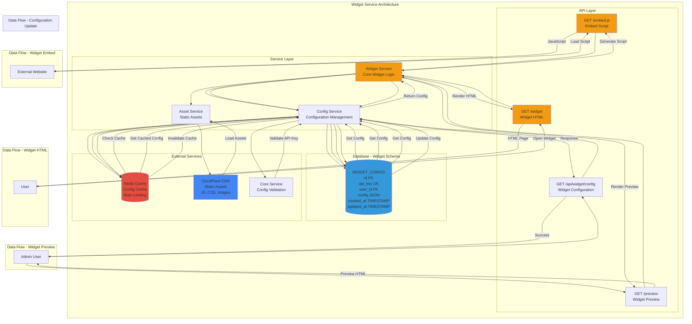

# Widget Service - Detailed Architecture Diagram

## Overview
The Widget Service is a lightweight, high-performance service dedicated to serving the chatbot widget HTML, JavaScript, and configuration to external websites.



## Database Schema Details

### WIDGET_CONFIG Table
- **Primary Key**: `id` (int)
- **Unique Key**: `api_key` (string)
- **Foreign Key**: `user_id` → USERS.id
- **Fields**: config (JSON), created_at, updated_at
- **Indexes**: api_key (unique), user_id
- **Config Structure**:
  ```json
  {
    "bot_name": "Janiz",
    "welcome_message": "Hi there!",
    "avatar": {...},
    "primary_color": {...},
    "widget_position": "bottom-right",
    "widget_theme": "light"
  }
  ```

## Service Responsibilities

### Widget Service
- Serve widget HTML and JavaScript
- Generate embed scripts
- Handle widget rendering
- Manage widget lifecycle

### Config Service
- Retrieve widget configuration
- Cache configuration in Redis
- Validate API keys
- Handle config updates

### Asset Service
- Serve static assets (JS, CSS, images)
- Integrate with CDN
- Handle asset versioning
- Optimize asset delivery

## API Endpoints

### GET /embed.js
- **Input**: `api_key` (query parameter)
- **Output**: JavaScript embed script
- **Flow**: Validate API Key → Get Config → Generate Script → Return
- **Caching**: CDN cache with long TTL
- **Content-Type**: `application/javascript`

### GET /widget
- **Input**: `api_key` (query parameter)
- **Output**: Widget HTML page
- **Flow**: Validate API Key → Get Config → Render HTML → Return
- **Caching**: Redis cache (5 minutes)
- **Content-Type**: `text/html`

### GET /preview
- **Input**: `user_id` (from session)
- **Output**: Widget preview HTML
- **Flow**: Get User Config → Render Preview → Return
- **Authentication**: Required (admin/user)

### GET /api/widget/config
- **Input**: `api_key` (query parameter)
- **Output**: Widget configuration JSON
- **Flow**: Validate API Key → Get Config → Return
- **Caching**: Redis cache (5 minutes)

### PUT /api/widget/config
- **Input**: `api_key`, `config` (JSON)
- **Output**: Updated configuration
- **Flow**: Validate → Update → Invalidate Cache → Return
- **Authentication**: Required (admin/user)

## Embed Script Structure

### Script Generation
```javascript
(function() {
    var d = document, s = d.createElement('script');
    s.src = 'https://cortex.janisrael.com/embed.js?api_key=XXX';
    s.async = 1;
    d.getElementsByTagName('head')[0].appendChild(s);
})();
```

### Widget Initialization
- **API Key**: Extracted from script URL or data attribute
- **Config**: Fetched from `/api/widget/config`
- **Widget**: Rendered in iframe or directly
- **Events**: Widget open, close, message sent

## Widget Features

### Configuration Options
- **Bot Name**: Display name in widget
- **Welcome Message**: Initial message shown
- **Avatar**: Bot avatar image
- **Primary Color**: Widget theme color
- **Position**: bottom-right, bottom-left, etc.
- **Theme**: light, dark, auto

### Widget Behavior
- **Trigger Button**: Floating button with avatar
- **Chat Window**: Expandable chat interface
- **Message History**: Persistent conversation
- **Typing Indicator**: Show bot is typing
- **Error Handling**: Graceful error messages

## Performance Optimization

### Caching Strategy
- **Config Cache**: Redis (5 minutes TTL)
- **Asset Cache**: CDN (long TTL, versioned)
- **Script Cache**: CDN (long TTL)
- **HTML Cache**: Redis (5 minutes TTL)

### CDN Integration
- **Static Assets**: JS, CSS, images served from CDN
- **Edge Caching**: Global distribution
- **Versioning**: Asset versioning for cache busting
- **Compression**: Gzip/Brotli compression

### Rate Limiting
- **Per API Key**: Limit requests per API key
- **Per IP**: Limit requests per IP address
- **Redis**: Store rate limit counters
- **Headers**: X-RateLimit-* headers

## Security Features

### API Key Validation
- **Validation**: Validate API key on every request
- **Caching**: Cache validation results in Redis
- **Expiration**: Support API key expiration
- **Revocation**: Support API key revocation

### CORS Configuration
- **Allowed Origins**: Configurable allowed origins
- **Headers**: CORS headers for cross-origin requests
- **Credentials**: Support credentials if needed

### XSS Protection
- **Content Security Policy**: CSP headers
- **Input Sanitization**: Sanitize all inputs
- **Output Encoding**: Encode all outputs

## Integration Points

### Redis Cache
- **Purpose**: Config caching, rate limiting
- **TTL**: 5 minutes for config, 1 hour for rate limits
- **Data**: Widget config, API key validation, rate limit counters

### CDN (CloudFlare)
- **Purpose**: Static asset delivery
- **Assets**: embed.js, widget.css, images
- **Benefits**: Global distribution, fast loading

### Core Service
- **Purpose**: API key validation, config updates
- **Method**: REST API call
- **Data**: API key → Validation result, Config updates

## Widget Metrics

### Performance Metrics
- **Load Time**: Time to load widget
- **Response Time**: API response times
- **Cache Hit Rate**: Config cache hit rate
- **Error Rate**: Error percentage

### Usage Metrics
- **Widget Opens**: Number of widget opens
- **Messages Sent**: Number of messages
- **Active Users**: Unique users using widget
- **Geographic Distribution**: User locations

